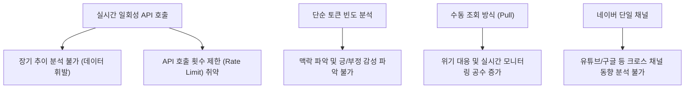
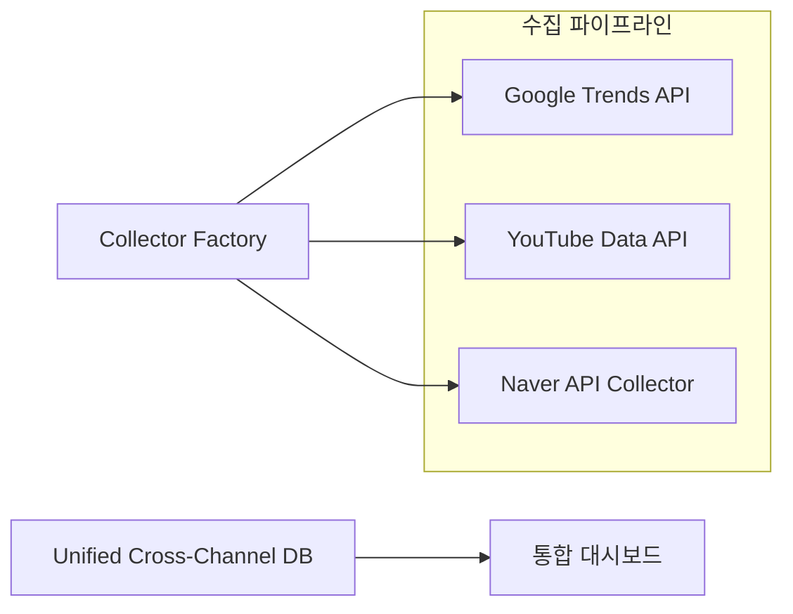
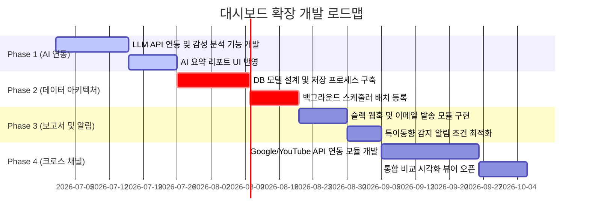

# 네이버 API 종합 분석 대시보드 비즈니스 기능 확장 및 개선 기획안

본 기획안은 기존의 `naver-api-app` 대시보드 소스 코드를 면밀히 분석하고, 마케팅 및 커머스 비즈니스 실무에서 데이터 가치를 극대화할 수 있는 기능 개선 방향과 신규 비즈니스 기능 확장 모델을 제시합니다.

---

## 1. 개요 (Executive Summary)

현재 `naver-api-app`은 네이버 오픈 API(데이터랩 및 검색 API)를 활용하여 실시간 검색어 트렌드와 소셜/쇼핑 반응을 시각화하는 우수한 프로토타입 대시보드입니다. 그러나 일회성 조회 중심의 실시간 호출 구조는 과거 데이터의 누적 분석이나 다각적인 인사이트 도출 등 **비즈니스 의사결정 지원 도구**로서 다소 한계가 있습니다.

본 기획안은 대시보드를 단순한 '데이터 뷰어'에서 **'엔터프라이즈급 마케팅 인텔리전스 솔루션'**으로 진화시키기 위한 4대 핵심 확장 기능을 제안하고, 구현 로드맵과 비즈니스 기대 효과를 제시합니다.

---

## 2. 기존 시스템 분석 (As-Is)

### 2.1. 코드 및 기능 분석
*   **시스템 아키텍처 (`src/collectors.py`)**: 
    *   `BaseCollector` 추상 클래스와 `CollectorFactory` 팩토리 패턴을 기반으로 설계되어 새로운 플랫폼 수집기 추가에 유연한 구조를 가지고 있습니다.
    *   `NaverCollector`는 네이버 데이터랩(통합 검색, 쇼핑 검색) 및 검색 API(블로그, 뉴스, 카페글, 쇼핑 상품)를 담당합니다.
    *   Streamlit의 `@st.cache_data`를 통해 호출 속도를 최적화하고 있으나, 세션 만료나 서버 재시작 시 캐시 데이터가 휘발되는 구조입니다.
*   **대시보드 기능 (`src/app.py`)**:
    *   Plotly를 활용한 데이터랩 트렌드(상대 비율) 시각화 및 기술 통계량 요약을 제공합니다.
    *   블로그/뉴스/카페글 데이터를 수집하여 등록량 추이와 단순 텍스트 토큰 빈도(Word Frequency) 분석을 제공합니다.
    *   쇼핑 상품 데이터를 분석하여 가격 분포(Box Plot), 브랜드 점유율, 카테고리 분포(Sunburst Chart)를 제공합니다.
    *   단일 키워드 통합 뷰(Unified View)를 통해 소셜(블로그)과 미디어(뉴스)의 추이를 교차 비교합니다.

### 2.2. 실무 및 비즈니스 관점에서의 As-Is 한계점

> [!WARNING]
> **실무 활용 시 임계 장애점**
> 1. **과거 데이터 이력 단절**: 네이버 검색 API는 최근 100건(최대 1,000건)의 결과만 제공하므로, 과거 특정 시점의 여론이나 경쟁사 가격 추이를 역추적할 수 없습니다.
> 2. **키워드 맥락 분석 부재**: 단순 조사 제거 방식의 단어 빈도 분석은 "좋다", "나쁘다"와 같은 여론의 긍·부정(Sentiment)이나 주요 불만 사항 등 핵심 맥락을 짚어내지 못합니다.
> 3. **업무 효율성**: 사용자가 매번 대시보드에 직접 접속하여 키워드를 검색해야 하므로 데일리 트렌드 리포팅 등의 반복 업무 자동화가 어렵습니다.

---

## 3. 신규 비즈니스 기능 확장 기획 (To-Be)

실무 활용성과 비즈니스 가치를 극대화하기 위해 다음과 같은 4가지 신규 기능의 추가를 제안합니다.

### 기능 1: 데이터 정기 스크래핑 및 자체 DB 누적 파이프라인 (Data Assetization)

*   **구현 내용**: 
    *   대시보드 웹 실행과 별개로 동작하는 백그라운드 스케줄러(예: APScheduler 또는 Airflow)를 구축합니다.
    *   매일 특정 시간(예: 오전 2시)에 설정된 핵심 키워드군에 대한 네이버 데이터랩 검색량 지수 및 뉴스/블로그/쇼핑 API 데이터를 수집합니다.
    *   수집된 원시 데이터를 데이터베이스(PostgreSQL, MySQL 또는 경량 SQLite)에 저장하여 누적합니다.
*   **기술 스택**: Python (APScheduler), SQLAlchemy, PostgreSQL/SQLite, Streamlit(DB 연동 조회)
*   **비즈니스 가치**:
    *   **데이터 자산화**: 시간이 지나면 사라지는 소셜 여론과 경쟁사 상품 가격 데이터를 영구 소장하여 고유한 비즈니스 자산으로 구축합니다.
    *   **장기 시계열 분석**: YoY(전년 동기 대비), MoM(전월 동기 대비) 등 장기 추이 분석 및 시즌성 예측 분석이 가능해집니다.
    *   **API 비용 및 속도 최적화**: API 실시간 호출을 줄이고 누적된 로컬 DB 데이터를 쿼리함으로써 대시보드 로딩 속도를 혁신적으로 단축합니다.

---

### 기능 2: LLM(Claude/OpenAI) 연동 경쟁 키워드 AI 요약 및 감성 분석 (AI Intelligence)

*   **구현 내용**:
    *   수집된 블로그, 뉴스, 카페글의 제목과 설명(Description) 텍스트를 LLM(예: Claude API, GPT-4o)에 입력으로 제공합니다.
    *   단순 빈도 분석을 넘어, **여론의 긍·부정 비율(Sentiment score)**을 정량화하여 대시보드에 시각화합니다.
    *   소비자가 해당 키워드에 대해 느끼는 **주요 긍정 요인(만족 요소)과 부정 요인(페인 포인트)**을 AI가 카테고리별로 자동 분류 및 요약 리포트를 생성합니다.
*   **기술 스택**: Anthropic SDK (Claude Sonnet), LangChain, Plotly (감성 지수 시각화)
*   **비즈니스 가치**:
    *   **의사결정 속도 단축**: 마케터가 수천 개의 블로그 글이나 기사를 일일이 읽지 않고도, 소비자의 핵심 불편 사항과 브랜드 평판의 변화를 단 5초 만에 파악할 수 있습니다.
    *   **제품 개선 피드백 루프**: 쇼핑 리뷰 및 소셜 여론에서 도출된 부정 요인을 제품 기획 및 CS 부서에 즉각 전달하여 제품 사용성을 개선할 수 있습니다.

---

### 기능 3: 다중 플랫폼 확장 및 크로스 채널 분석 (Cross-Channel Integration)

*   **구현 내용**:
    *   기존 `src/collectors.py`의 `CollectorFactory`와 `BaseCollector` 인터페이스를 계승하여 `GoogleCollector` 및 `YoutubeCollector`를 추가 구현합니다.
    *   **구글 트렌드 API**: 글로벌 및 국내 구글 검색량 추이를 비교합니다.
    *   **유튜브 API**: 특정 키워드로 검색된 인기 영상 리스트, 조회수/좋아요 수 추이, 댓글 텍스트 데이터를 수집합니다.
    *   이를 단일 대시보드 내에서 네이버 데이터와 나란히 비교 시각화하는 '크로스 채널 트렌드 뷰'를 구성합니다.
*   **기술 스택**: PyGoogleTrends (pytrends), Google API Client (YouTube), `collectors.py` 고도화
*   **비즈니스 가치**:
    *   **크로스 미디어 이펙트 측정**: 특정 마케팅 캠페인 진행 시, 포털 검색(네이버/구글)의 상승과 영상 플랫폼(유튜브)에서의 반응 확산 간의 상관관계를 다각도로 평가할 수 있습니다.
    *   **글로벌 트렌드 센싱**: 국내 시장(네이버)에 국한되지 않고, 글로벌 마켓(구글/유튜브)의 트렌드를 함께 추적하여 수출 상품 기획이나 해외 진출 전략 수립에 활용합니다.

---

### 기능 4: 이메일 보고서 자동 발송 및 실시간 Alert 서비스 (Automated Delivery)

*   **구현 내용**:
    *   매주/매월 분석 데이터를 요약한 보고서를 HTML 또는 PDF 형태로 자동 렌더링합니다.
    *   등록된 담당자 이메일 목록으로 보고서를 자동 발송하는 메일러 모듈을 구축합니다.
    *   **이상 징후 알림(Alerting)**: 수집된 데이터 중 특정 브랜드의 '부정 키워드(예: 결함, 환불, 논란 등)' 비율이 설정된 임계치(예: 30%)를 초과하거나, 일일 뉴스 언급량이 평소 대비 3배 이상 급증할 경우, 마케팅/PR 담당자에게 즉시 SMS 또는 슬랙(Slack) 웹훅으로 긴급 경고 알림을 발송합니다.
*   **기술 스택**: Python `smtplib` (Email), ReportLab (PDF 생성), Slack Webhook API
*   **비즈니스 가치**:
    *   **업무 자동화**: 수동 리포트 작성 공수를 0에 가깝게 줄여 마케터가 '보고서 작성'이 아닌 '전략 수립'에 집중할 수 있게 합니다.
    *   **브랜드 위기 관리 (Crisis Management)**: 브랜드 평판 리스크나 부정 여론 확산을 초기에 감지하여, 소셜 미디어 위기가 대규모 언론 보도로 번지기 전에 선제적 PR 대응을 가능하게 합니다.

---

## 4. 기능 구현 우선순위 및 로드맵 (Roadmap)

각 기능의 **비즈니스 중요도(Value)**와 **기술적 구현 난이도(Complexity)**를 종합하여 최적의 개발 로드맵을 수립했습니다.

### 4.1. 우선순위 매트릭스 (Action Priority Matrix)

| 구분 | 낮은 난이도 (Low Complexity) | 높은 난이도 (High Complexity) |
| :--- | :--- | :--- |
| **높은 비즈니스 가치 (High Value)** | **[1순위] LLM 연동 AI 요약 및 감성 분석** · 즉각적인 시각적 가치 제공 · API 호출 기반으로 즉시 연동 가능 | **[2순위] 정기 스크래핑 및 DB 구축** · 아키텍처 변경 필요 (DB/스케줄러) · 데이터 자산화의 근간 확보 |
| **보통/낮은 비즈니스 가치 (Medium Value)** | **[3순위] 이메일 리포팅 및 슬랙 알림** · 기존 수집 라이브러리 활용 · 웹훅 및 메일 발송 모듈 추가 | **[4순위] 다중 플랫폼 확장 (구글/유튜브)** · 플랫폼별 인증 및 API 스펙 다변화 · 데이터 통합 규격화 필요 |

### 4.2. 단계별 개발 로드맵 (Phased Roadmap)

1.  **Phase 1 (AI Intelligence - 1개월 차)**:
    *   기존 실시간 분석 화면에 AI 오피니언 리포트 및 감성 점수 차트(긍정/부정 비율) 탑재.
    *   실무자들이 대시보드 도입 효과를 가장 빠르게 체감할 수 있는 'Quick-Win' 단계.
2.  **Phase 2 (Data Assetization - 2개월 차)**:
    *   백그라운드 수집 데몬(Daemon)과 관계형 데이터베이스(DB) 환경 구축.
    *   누적 데이터를 대시보드에 바인딩하여 '시계열 추이 분석' 기능 활성화.
3.  **Phase 3 (Automated Delivery - 3개월 차)**:
    *   매주 월요일 아침 요약 리포트 자동 메일링 시스템 가동.
    *   부정 여론 급증 시 슬랙 긴급 알림 연동으로 위기 관리 프로세스 셋업.
4.  **Phase 4 (Cross-Channel - 4개월 차)**:
    *   구글 트렌드 및 유튜브 API를 연동하여 포털과 동영상 채널을 아우르는 360도 마케팅 인텔리전스로 완성.

---

## 5. 비즈니스 기대 효과

본 기능 확장을 통해 비즈니스 조직은 다음과 같은 실무적, 재무적 효과를 얻을 수 있습니다.

1.  **리서치 공수 절감 (생산성 향상)**:
    *   매일 아침 수동으로 키워드를 검색하고 경쟁사 동향을 엑셀로 정리하던 리서치 공수를 자동 스케줄러와 AI 요약을 통해 **최소 85% 이상 절감**합니다.
2.  **의사결정 정확도 제고**:
    *   단순 검색 트렌드가 아닌 실질적인 소셜 감성 데이터와 브랜드 인지도 지표를 시각화하여, 감에 의존하지 않는 **데이터 기반(Data-Driven) 마케팅 예산 집행**이 가능해집니다.
3.  **리스크 비용 최소화**:
    *   제품 불량, CS 논란 등 리스크 요인의 실시간 감지(Alerting)를 통해 브랜드 이미지 타격 및 고객 이탈로 인한 **잠재적 재무적 손실을 선제적으로 차단**합니다.
4.  **자체 데이터 경쟁력 확보**:
    *   경쟁사 가격 데이터, 카테고리별 검색 데이터의 지속적 누적을 통해 외부 데이터 솔루션(구독형 유료 도구)의 의존도를 줄이고 **자사만의 데이터 자산(Data Capital)**을 내재화합니다.

---

> [!NOTE]
> **기획 방향성 제언**
> 본 기획안에 따라 순차적으로 기능을 고도화할 경우, `naver-api-app` 프로젝트는 단순한 API 연습용 토이 프로젝트에서 비즈니스 실무에 바로 투입되어 ROI(투자 대비 효과)를 증명할 수 있는 고부가가치 비즈니스 애플리케이션으로 탈바꿈하게 될 것입니다.
