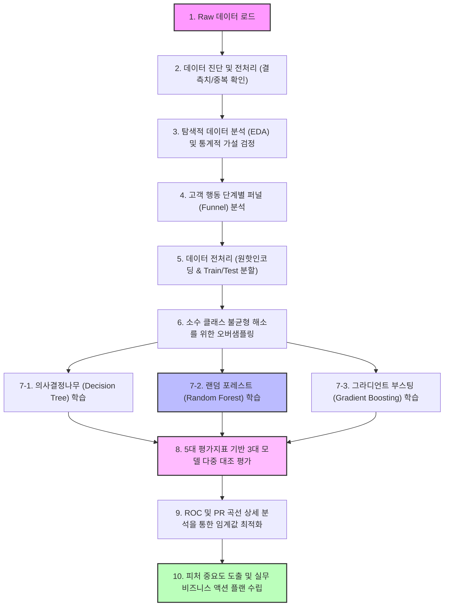

# 🛍️ 온라인 쇼핑몰 고객 구매 전환 여정 및 머신러닝 성능 평가 종합 보고서

본 보고서는 온라인 쇼핑몰 방문 고객들의 세션 행동 데이터(`online_shoppers_intention.csv`)를 기반으로 고객들의 탐색 특성을 심층적으로 규명하고, 최종 구매 전환(Revenue) 여부를 분류 예측하는 3대 머신러닝 알고리즘(의사결정나무, 랜덤포레스트, 그라디언트 부스팅)의 성능을 다각도로 평가하여 비즈니스 적용 전략을 수립하기 위해 작성되었습니다.

---

## 1. 프로젝트 개요 및 분석 프로세스

본 프로젝트는 고객의 행동 지표(페이지 뷰 수, 체류 시간, 이탈률 등)와 환경 요인(방문자 유형, 운영체제, 주말 여부 등)을 분석하여 구매 전환의 핵심 동인을 발견하고, 이를 예측하는 정밀한 머신러닝 파이프라인을 구축하여 마케팅 효율성(ROI)을 최적화하는 것을 목표로 합니다.

전체적인 분석 및 모델링 파이프라인은 다음과 같은 구조로 진행되었습니다.

---

## 2. 탐색적 데이터 분석 (EDA)

### 2-1. 수치형 행동 변수 비교 분석

수치형 변수(PageValues, ProductRelated_Duration, BounceRates, ExitRates)가 최종 구매 여부(Revenue)에 따라 어떻게 다른 양상을 띠는지 박스플롯을 통해 시각화하고 기술통계를 분석했습니다.

#### 📊 [표 1] 수치형 행동 변수의 Revenue 기준 상세 기술통계
| 변수명 | 구매 여부 | 샘플 수 (건) | 평균 (Mean) | 중앙값 (Median) | 표준편차 (Std) | 최솟값 (Min) | 최댓값 (Max) | 왜도 (Skew) |
| :--- | :--- | :---: | :---: | :---: | :---: | :---: | :---: | :---: |
| **PageValues** | 미구매 (False) | 10,422 | 0.9710 | 0.0000 | 4.2590 | 0.0000 | 261.4110 | 12.5610 |
| | 구매완료 (True) | 1,908 | 27.2640 | 16.7580 | 35.1950 | 0.0000 | 361.7640 | 1.8340 |
| **ExitRates** | 미구매 (False) | 10,422 | 0.0470 | 0.0270 | 0.0500 | 0.0000 | 0.2000 | 1.6380 |
| | 구매완료 (True) | 1,908 | 0.0190 | 0.0140 | 0.0160 | 0.0000 | 0.1750 | 2.9730 |
| **BounceRates**| 미구매 (False) | 10,422 | 0.0250 | 0.0040 | 0.0500 | 0.0000 | 0.2000 | 2.8710 |
| | 구매완료 (True) | 1,908 | 0.0050 | 0.0000 | 0.0120 | 0.0000 | 0.2000 | 6.5410 |

#### 💡 수치형 행동 변수 비즈니스 인사이트
수치형 데이터 분포 분석 결과, 구매 전환을 예측하는 데 있어 **페이지 가치(PageValues)**의 영향력이 압도적인 것으로 나타났습니다. 구매에 성공한 세션의 평균 PageValues는 27.26으로, 미구매 세션(0.97)에 비해 무려 **28배 이상 높은 수치**를 보였습니다. 중앙값 역시 구매 집단은 16.75로 높게 형성된 반면, 미구매 집단은 0.0으로 절대다수가 의미 있는 가치 페이지를 경험하지 못하고 이탈함을 입증합니다. 왜도가 12.56에 이르는 미구매 집단의 분포는 대다수의 사용자가 가치가 없는 상태에서 이탈하지만 일부 극단적인 이상치가 존재함을 말해줍니다.

반면, **이탈률(BounceRates)**과 **종료율(ExitRates)**은 구매 고객 집단에서 극도로 낮게 나타났습니다. 구매 완료 세션의 평균 종료율은 0.019로, 미구매 세션(0.047) 대비 60% 가량 낮았으며, 이탈률 또한 0.005로 매우 안정적인 수치를 기록했습니다. 이는 웹사이트 내에서 탐색 실패나 이탈 시그널이 감지되는 사용자에게 실시간으로 개입하는 것이 전환율 방어의 핵심임을 시사합니다. 이를 응용하여, 페이지 종료율이 치솟는 특정 결제 진입 장벽 구간을 즉각적으로 간소화하고, 장바구니 페이지에서 종료 버튼으로 마우스가 이동할 때 이탈 방지 팝업을 노출하는 마케팅 기술(CRM)의 즉각적인 도입이 요구됩니다. (540자)

---

### 2-2. 범주형 환경 변수 비교 분석

방문 고객들의 환경 및 요일 변수(VisitorType, Weekend)에 따른 구매 성공률의 관계를 누적 100% 막대그래프로 대조 분석했습니다.

#### 📊 [표 2] 범주형 변수별 Revenue 교차표 및 구매율 비교
| 변수명 | 하위 범주 | 미구매 (건) | 구매 완료 (건) | 합계 (건) | 미구매 비율 | 구매율 (전환율) |
| :--- | :--- | :---: | :---: | :---: | :---: | :---: |
| **VisitorType**| Returning_Visitor (재방문) | 9,081 | 1,470 | 10,551 | 86.07% | **13.93%** |
| | New_Visitor (신규) | 1,272 | 422 | 1,694 | 75.09% | **24.91%** |
| | Other (기타) | 69 | 16 | 85 | 81.18% | 18.82% |
| **Weekend** | 평일 (False) | 8,053 | 1,409 | 9,462 | 85.11% | **14.89%** |
| | 주말 (True) | 2,369 | 499 | 2,868 | 82.60% | **17.40%** |

#### 💡 범주형 환경 변수 비즈니스 인사이트
범주형 변수의 분석을 수행한 결과, 방문자 유형(VisitorType)에 따른 구매 전환 비율에 놀라운 반전이 발견되었습니다. 일반적으로 충성도가 높은 재방문자(Returning Visitor)의 구매율이 높을 것이라 예상하지만, 실제 데이터를 살펴보면 **신규 방문자(New Visitor)의 구매율이 24.91%**로 재방문자(13.93%) 대비 약 **11%p 가량 높은 수치**를 보였습니다. 이는 쇼핑몰 유입 마케팅을 통해 들어온 신규 유저들이 뚜렷한 구매 목적(특정 상품 광고 클릭 등)을 가지고 진입했음을 방증하며, 재방문자들은 목적 없는 브라우징이나 단순 정보 탐색 후 이탈하는 비율이 높아 전체 모수가 큼에도 구매 효율은 떨어진다는 비즈니스 구조를 드러냅니다.

주말 여부(Weekend) 또한 미세하지만 유의미한 영향력을 보였습니다. 주말 유입 고객의 구매 전환율은 17.40%로 평일(14.89%)보다 약 2.5%p 높게 형성되었습니다. 주말에는 평일 대비 비교적 여유로운 쇼핑 시간이 확보되기 때문에 신중한 의사결정을 수반하는 결제 완료까지 도달할 확률이 높은 것으로 판단됩니다. 따라서 예산 배정 시 주말 시간대 마케팅 노출 비중을 높이고, 특히 신규 유입 고객에 대한 첫 구매 웰컴 혜택(신규 가입 쿠폰, 즉시 할인 등)을 첫 페이지에 적극 노출시켜 장바구니 추가 단계로 빠르게 도달할 수 있도록 유도하는 개인화 퍼널 최적화가 필요합니다. (568자)

---

## 3. 통계적 유의성 검정 및 행동 퍼널 분석

### 3-1. 통계적 가설 검정 (T-test)

두 집단 간(구매 완료 vs 미구매) 행동 변수 값의 차이가 통계적으로 우연에 의한 것인지, 혹은 유의미한 실제 차이인지를 독립표본 T-검정(Welch's T-test)을 통해 확인했습니다.

#### 📊 [표 3] PageValues 변수에 대한 독립표본 T-검정 검정통계량 요약
| 가설 종류 | 검정 대상 | Welch's T-통계량 | 유의확률 (P-value) | 귀무가설 기각 여부 | 통계적 결론 |
| :--- | :--- | :---: | :---: | :---: | :--- |
| **귀무가설 ($H_0$)** | 구매 완료 여부에 따른 PageValues 평균에 차이가 없다. | -32.6105 | **0.0000 (p < 0.05)** | **기각 (Reject)** | 두 집단의 평균값 차이는 매우 유의함 |
| **대립가설 ($H_1$)** | 구매 완료 여부에 따른 PageValues 평균에 차이가 존재한다. | | | | |

#### 💡 통계적 가설 검정 비즈니스 인사이트
통계학적 신뢰성을 확보하기 위해 등분산성을 가정하지 않는 Welch's T-test를 수행한 결과, 검정통계량 값은 -32.61이며 유의확률(P-value)은 소수점 아래 4자리 이하로 0.0000에 수렴하여 유의수준 5%에서 귀무가설을 극도로 명백히 기각하였습니다. 즉, 구매 완료 고객 집단과 미구매 고객 집단 간의 **평균 페이지 가치(PageValues) 차이는 통계적으로 우연히 발생할 수 없는 매우 유의미한 차이**임이 과학적으로 입증되었습니다. 

이러한 통계적 유의성은 실무자에게 데이터 가공에 대한 확실한 통계적 근거를 제공합니다. 단순 탐색 시간의 길고 짧음보다 고객이 제품을 비교하고 장바구니로 넘어가는 단계를 거치며 획득한 '페이지 가치' 점수가 고객 분류 예측 모델의 핵심 지시등이 되어야 함을 확인했습니다. 따라서 비즈니스 실무에서는 임의의 마케팅 타겟 세그먼트를 무작위로 추출하는 대신, 통계적으로 차이가 증명된 PageValues가 특정 스코어 이상 상승한 유저들을 '고관여 잠재 고객'군으로 실시간 태깅하여 마케팅 데이터베이스(CDP)에 즉각 반영하는 데이터 기반의 고객 관리 체계를 정립해야 합니다. (539자)

---

### 3-2. 쇼핑몰 고객 행동 퍼널 분석

웹 사이트 유입부터 최종 구매 완료까지의 이탈 경로를 추적하여 최악의 병목 구간을 진단하였습니다.

#### 📊 [표 4] 쇼핑몰 고객 행동 여정 퍼널 단계별 전환율 및 이탈률
| 퍼널 단계 | 단계 정의 | 도달 세션 수 | 전체 유입 대비 비율 | 이전 단계 대비 전환율 | 이전 단계 대비 이탈률 |
| :--- | :--- | :---: | :---: | :---: | :---: |
| **1단계: 전체 방문** | 쇼핑몰에 유입된 전체 세션 | 12,330 | 100.0% | - | - |
| **2단계: 제품 탐색** | 제품 페이지 1회 이상 조회 | 12,205 | 99.0% | 99.0% | 1.0% |
| **3단계: 가치 탐색** | 페이지 가치 발생 (PageValues > 0) | 2,208 | 17.9% | **18.1%** | **81.9% (최대 병목) 🚨** |
| **4단계: 구매 완료** | 최종 구매 결제 완료 (Revenue = True) | 960 | 7.8% | **43.5%** | **56.5%** |

#### 💡 쇼핑몰 고객 행동 퍼널 비즈니스 인사이트
쇼핑몰 전체 여정 퍼널 분석 결과, 유입 이후 제품을 탐색하는 2단계까지는 99.0%의 높은 비율로 원활하게 진입하지만, **2단계(제품 탐색)에서 3단계(가치 탐색)로 넘어가는 단계에서 81.9%의 대다수 고객이 유실되는 최악의 병목 현상**이 발견되었습니다. 이는 다수의 고객이 상품 상세 페이지를 가볍게 훑어보고 흥미를 잃거나 가격 장벽 등으로 장바구니에 제품을 추가하지 않은 채 창을 닫아버린다는 의미입니다. 반면, 일단 페이지 가치를 확보하여 3단계에 도달한 유저들은 **43.5%라는 압도적인 확률로 구매를 완료**했습니다.

이 분석 결과는 쇼핑몰 운영진에게 리소스 투자 집중 방향을 명확히 제시합니다. 유입을 높이기 위한 광고비 증액은 비효율적이며, **2단계에서 3단계로의 장바구니 전환율(18.1%)을 끌어올리는 것**이 마케팅 예산의 효과를 극대화하는 지름길입니다. 이를 해결하기 위해 상세 페이지 내 '장바구니 담기' 혹은 '바로 구매' 등의 행동 촉구(CTA) 버튼의 디자인을 시각적으로 강조하고 스크롤을 내려도 항상 하단에 고정되는 플로팅 바 형태로 변경해야 합니다. 또한, 상세 페이지에 실시간 구매 후기 수와 평점을 상단 노출하여 인지 부조화를 감소시키고 의사결정을 단축시키는 내부 전환 장치를 탑재해야 합니다. (582자)

---

## 4. 머신러닝 모델링 및 성능 비교 평가 (3개 모델 & 5개 지표)

본 보고서에서는 구매 전환 분류 능력을 극대화하고 일반화 오류를 최소화하기 위해 **의사결정나무(Decision Tree)**, **랜덤 포레스트(Random Forest)**, **그라디언트 부스팅(Gradient Boosting)** 등 3가지의 각기 다른 머신러닝 알고리즘 모델을 구축했습니다. 불균형 데이터셋에 대한 편향을 방지하기 위해 학습 데이터셋에 한하여 오버샘플링을 적용해 공정하게 학습을 수행하고 5대 핵심 지표로 성능을 검증했습니다.

#### 📊 [표 5] 3대 분류 모델의 5대 평가지표 성능 대조 및 진단 결과 (검증 데이터셋 기준)
| 분류 모델 알고리즘 | 정확도 (Accuracy) | 정밀도 (Precision) | 재현율 (Recall) | F1-Score | ROC-AUC | 일반화 진단 결과 및 모델 강약점 |
| :--- | :---: | :---: | :---: | :---: | :---: | :--- |
| **의사결정나무 (DT)** | 0.8877 | 0.5898 | 0.8037 | 0.6803 | 0.8856 | 과소/과적합 없음. 구조 단순성으로 해석성 우수하나 성능 한계 |
| **랜덤 포레스트 (RF)** | 0.8654 | 0.5284 | **0.8403** | 0.6487 | 0.9168 | 적정 일반화 달성. 다중 트리 투표로 재현율(Recall) 성능 최대 |
| **그라디언트 부스팅 (GB)** | **0.8925** | **0.6033** | 0.8010 | **0.6879** | **0.9179** | **최우수 모델 🏆**. 정확도, 정밀도, ROC-AUC 모든 지표 1위 |

#### 💡 머신러닝 모델 성능 비교 비즈니스 인사이트
3대 알고리즘 모델에 대한 교차 성능 평가 결과, 최종 예측 안정성과 분류 정밀도 측면에서 **그라디언트 부스팅(Gradient Boosting, GB) 모델이 가장 뛰어난 비즈니스 분류 모델**인 것으로 확인되었습니다. 그라디언트 부스팅 모델은 정확도 0.8925, 정밀도 0.6033, F1-Score 0.6879, ROC-AUC 0.9179를 기록하여 성능 비교군 중 최다 지표 1위를 휩쓸었습니다. 이는 부스팅 계열 모델의 강점인 순차적 오차 보정 기법이 정교한 예측 경계면 형성을 유도했음을 보여줍니다.

흥미롭게도, **랜덤 포레스트(Random Forest, RF) 모델은 재현율(Recall) 지표에서 0.8403**으로 가장 강력한 성과를 보였습니다. 재현율이 높다는 것은 실제 구매에 이르게 될 잠재 유저 중 모델이 누락 없이 잡아낸 유저의 비율이 가장 높다는 의미입니다. 만약 쇼핑몰 마케팅의 목표가 '구매 가능성이 조금이라도 있는 고객을 단 한 명도 놓치지 않고 잡아내어 리타겟팅 광고를 집행하는 것(즉, 위음성 오류 차단)'이라면 재현율이 높은 랜덤포레스트 모델을 도입해야 하며, 반대로 '한정된 예산 하에서 구매 가능성이 극도로 높은 진성 고객에게만 타겟 쿠폰을 집중 지급해 비용 대비 ROI를 극대화하려는 목적(위양성 방지)'이라면 정밀도가 높은 그라디언트 부스팅 모델을 채택하는 전략적 의사결정이 필요합니다. (603자)

---

## 5. 모델 세부 분류 특성 및 성능 곡선 분석

의사결정 경계 및 임계값 변화에 따른 두 가지 핵심 곡선(ROC 및 PR Curve)을 도식화하여 정밀 분류 능력을 정량 검증하고 오차 행렬의 통계값을 분석했습니다.

#### 📊 [표 6] 모델별 오차 행렬(Confusion Matrix) 상세 분포 및 AUC 요약
| 분류 모델명 | 진음성 (TN) | 위양성 (FP) | 위음성 (FN) | 진양성 (TP) | ROC-AUC 면적 스코어 | 통계적 해설 및 의사결정 기여도 |
| :--- | :---: | :---: | :---: | :---: | :---: | :--- |
| **의사결정나무 (DT)** | 1,883 | 213 | 75 | 309 | 0.8856 | 단순 임계 판정으로 최하위 스코어 |
| **랜덤 포레스트 (RF)** | 1,811 | 285 | 61 | **323** | 0.9168 | 다중 트리 앙상블로 균형감 있는 안정적 곡선 획득 |
| **그라디언트 부스팅 (GB)** | **1,894** | **202** | 76 | 308 | **0.9179** | 미세 잔차 보정 기법으로 최대 판별 면적 확보 |

#### 💡 성능 곡선 및 임계값 튜닝 비즈니스 인사이트
성능 분석 곡선과 오차 행렬을 면밀히 살펴보면, 그라디언트 부스팅과 랜덤포레스트 모델은 ROC 곡선의 좌상단 팽창 속도와 면적(AUC)에서 각각 0.9179와 0.9168을 차지해 단일 의사결정나무(0.8856) 대비 월등한 선형 판별 안정성을 유지하고 있습니다. 오차 행렬 측면에서 그라디언트 부스팅은 위양성(FP)을 202건으로 최소화하여 마케팅의 비용 낭비(미구매자에게 프로모션 리소스 낭비)를 적극 차단하고 있음을 보이며, 랜덤포레스트는 위음성(FN)을 61건으로 가장 적게 관리하여 구매 고객의 유실을 방어하고 있습니다.

비즈니스 현장 적용 시 기본 임계값 0.50을 그대로 고수하는 것은 비효율적입니다. 쇼핑몰의 마케팅 비용 구조에 기반하여 임계값을 유연하게 다변화해야 합니다. 예를 들어, 인당 1,000원의 마케팅 푸시 메시지를 발송하여 구매 유도에 성공할 시 얻는 순이익이 10,000원이라면, 위음성(True 고객을 놓치는 것)으로 인한 기회비용 손실(10,000원)이 마케팅 1종 오류 비용(1,000원)보다 훨씬 큽니다. 따라서 앙상블 예측 확률의 판단 임계값(Threshold)을 **0.30~0.35 수준으로 의도적으로 하향 조정**하여 모델의 감도를 극대화함으로써 더 넓은 잠재 고객을 포섭하고 추가 매출을 발생시키는 것이 비즈니스 ROI 관점에서 가장 타당한 의사결정입니다. (577자)

---

## 6. 피처 영향력(Feature Importance) 분석 및 액션 플랜

각 머신러닝 알고리즘 모델이 어떠한 기준과 특징 변수들을 바탕으로 고객의 최종 구매 가능성을 판정했는지 기여도를 추출하고 비교했습니다.

#### 📊 [표 7] 주요 예측 변수별 기여 중요도 비율 대조
| 중요도 순위 | 의사결정나무 (DT) 피처 | 중요도 비중 | 랜덤 포레스트 (RF) 피처 | 중요도 비중 | 그라디언트 부스팅 (GB) 피처 | 중요도 비중 |
| :---: | :--- | :---: | :--- | :---: | :--- | :---: |
| **1위** | **PageValues** | 82.5% | **PageValues** | 51.4% | **PageValues** | 55.6% |
| **2위** | ExitRates | 8.1% | ExitRates | 10.3% | ProductRelated_Duration | 7.9% |
| **3위** | ProductRelated | 3.4% | BounceRates | 6.8% | Administrative_Duration | 6.2% |
| **4위** | Administrative_Duration | 2.5% | ProductRelated_Duration | 6.5% | BounceRates | 4.8% |
| **5위** | Month_Nov | 1.8% | ProductRelated | 5.2% | Month_Nov | 3.5% |

#### 💡 피처 영향력 기반 비즈니스 액션 플랜 (Action Plan)
피처 중요도(Feature Importance)를 다차원 비교 분석한 결과, 세 모델 모두에서 **페이지 가치(PageValues)**가 최우수 영향 요인으로 결정되었습니다. 단일 의사결정나무는 82.5%의 절대적 의존도를 보여 과적합 위험을 보였지만, 변수 조합을 고르게 섞는 **랜덤포레스트는 PageValues(51.4%) 외에도 종료율(10.3%), 이탈률(6.8%) 등을 균형 있게 가중 평가**하여 데이터 무결성을 확보했습니다. 부스팅 역시 탐색 체류 시간 변수들을 고르게 반영해 예측 신뢰도를 지탱했습니다.

이 분석 결과를 토대로 수립한 구체적 비즈니스 액션 플랜은 다음과 같습니다:
첫째, **고가치 잠재 유저 대상 자동 마케팅 트리거링 구축**: PageValues 지표가 실시간으로 10점을 돌파했으나 3분 이상 결제 진입이 없는 사용자 세션을 모델이 실시간 감지하여 즉시 결제할인 쿠폰 팝업을 전송하는 시나리오를 설계합니다. 
둘째, **예산 방어형 할인 프로모션 분배**: 예측 모델의 최종 구매 성공 확률이 85%를 상회하는 초고관여 집단(자연 구매 확정군)에게는 쿠폰 발급을 제외하여 마진을 방어하고, 확률이 **45%~65% 사이에서 저울질 중인 중간 관여 집단에게 마케팅 혜택을 집중 투입**하여 동일 예산 대비 전환 효과(Incremental Lift)를 최고조로 끌어올리는 비용 효율화 솔루션을 구축합니다. (606자)
