# Shop Review 데이터 탐색적 분석 (EDA) 리포트

본 리포트는 `shop-review.csv` 데이터에 대한 심층적인 탐색적 데이터 분석(EDA) 결과를 담고 있습니다. 데이터의 기본 구조 확인부터, 단변량, 이변량, 텍스트 분석까지 다방면으로 데이터를 검토하였습니다.

## 1. 초기 데이터 점검 (Initial Data Inspection)

### 데이터 구조 및 결측치/중복 데이터 확인
- **전체 데이터 수**: 8,042 행
- **전체 컬럼 수**: 7 열
- **중복 행 수**: 4 개

### 처음 5행 미리보기
|    | title                                                                                                | content                                                                                                                                                                                                                                                                                                                                                                                                                                                                                                                                                                                                                                                                                                                                                                                                                                                                                                                                                                                                                                                                                                                                                                                                                                                                                                                                                                                                                                                                                                                                                                                                                                                                                                                                                                                                                                                                                                                                                                                                                                                                                                                                                                                                                                                                                                                                                                                                                                                                                                                                                                                                                                                                                                                                                                                                                                                                                                                                                                                                                                                                                                                                                                                                                                                                                                                                                                                                                                                                                                                                                                                                                                                                                                                                                                                                                                                                                                                                                                                                                                                                                                                                                  | product          | mallName     | combined_text                                                                                                                                                                                                                                                                                                                                                                                                                                                                                                                                                                                                                                                                                                                                                                                                                                                                                                                                                                                                                                                                                                                                                                                                                                                                                                                                                                                                                                                                                                                                                                                                                                                                                                                                                                                                                                                                                                                                                                                                                                                                                                                                                                                                                                                                                                                                                                                                                                                                                                                                                                                                                                                                                                                                                                                                                                                                                                                                                                                                                                                                                                                                                                                                                                                                                                                                                                                                                                                                                                                                                                                                                                                                                                                                        |   title_length |   content_length |
|---:|:-----------------------------------------------------------------------------------------------------|:---------------------------------------------------------------------------------------------------------------------------------------------------------------------------------------------------------------------------------------------------------------------------------------------------------------------------------------------------------------------------------------------------------------------------------------------------------------------------------------------------------------------------------------------------------------------------------------------------------------------------------------------------------------------------------------------------------------------------------------------------------------------------------------------------------------------------------------------------------------------------------------------------------------------------------------------------------------------------------------------------------------------------------------------------------------------------------------------------------------------------------------------------------------------------------------------------------------------------------------------------------------------------------------------------------------------------------------------------------------------------------------------------------------------------------------------------------------------------------------------------------------------------------------------------------------------------------------------------------------------------------------------------------------------------------------------------------------------------------------------------------------------------------------------------------------------------------------------------------------------------------------------------------------------------------------------------------------------------------------------------------------------------------------------------------------------------------------------------------------------------------------------------------------------------------------------------------------------------------------------------------------------------------------------------------------------------------------------------------------------------------------------------------------------------------------------------------------------------------------------------------------------------------------------------------------------------------------------------------------------------------------------------------------------------------------------------------------------------------------------------------------------------------------------------------------------------------------------------------------------------------------------------------------------------------------------------------------------------------------------------------------------------------------------------------------------------------------------------------------------------------------------------------------------------------------------------------------------------------------------------------------------------------------------------------------------------------------------------------------------------------------------------------------------------------------------------------------------------------------------------------------------------------------------------------------------------------------------------------------------------------------------------------------------------------------------------------------------------------------------------------------------------------------------------------------------------------------------------------------------------------------------------------------------------------------------------------------------------------------------------------------------------------------------------------------------------------------------------------------------------------------------------------|:-----------------|:-------------|:-----------------------------------------------------------------------------------------------------------------------------------------------------------------------------------------------------------------------------------------------------------------------------------------------------------------------------------------------------------------------------------------------------------------------------------------------------------------------------------------------------------------------------------------------------------------------------------------------------------------------------------------------------------------------------------------------------------------------------------------------------------------------------------------------------------------------------------------------------------------------------------------------------------------------------------------------------------------------------------------------------------------------------------------------------------------------------------------------------------------------------------------------------------------------------------------------------------------------------------------------------------------------------------------------------------------------------------------------------------------------------------------------------------------------------------------------------------------------------------------------------------------------------------------------------------------------------------------------------------------------------------------------------------------------------------------------------------------------------------------------------------------------------------------------------------------------------------------------------------------------------------------------------------------------------------------------------------------------------------------------------------------------------------------------------------------------------------------------------------------------------------------------------------------------------------------------------------------------------------------------------------------------------------------------------------------------------------------------------------------------------------------------------------------------------------------------------------------------------------------------------------------------------------------------------------------------------------------------------------------------------------------------------------------------------------------------------------------------------------------------------------------------------------------------------------------------------------------------------------------------------------------------------------------------------------------------------------------------------------------------------------------------------------------------------------------------------------------------------------------------------------------------------------------------------------------------------------------------------------------------------------------------------------------------------------------------------------------------------------------------------------------------------------------------------------------------------------------------------------------------------------------------------------------------------------------------------------------------------------------------------------------------------------------------------------------------------------------------------------------------------|---------------:|-----------------:|
|  0 | 에어팟프로1세대를 계속 사용 했으나 배터리 빠른 소모로 인해 2세대로 교체 했습니다 ㅎㅎ에어팟프로 1세대 보다 2세대가 좋았던 점1.노이즈 캔슬링:노이즈캔슬링이 2배 더 좋아졌다고 | 에어팟프로1세대를 계속 사용 했으나 배터리 빠른 소모로 인해 2세대로 교체 했습니다 ㅎㅎ  에어팟프로 1세대 보다 2세대가 좋았던 점 1.노이즈 캔슬링:노이즈캔슬링이 2배 더 좋아졌다고 나왔는데 <em>2배로 좋아졌네요</em>^_^ 깜짝 놀랬어용!!  2.주변음 허용: <em>주변음 허용모드가 1세대 비해 더 또렷하게 들여서 최고</em>!!!  3.사운드: 에어팟프로1세대 보다 2세대가 더 베이스도 좋아지고 극저음,저음,고음,극고음 이 더 깔끔하게 들리면서 귀가 부담 되지 않을정도로 많이 좋아지고, 가수와피아노,베이스 등 분리도에 있어서 1세대 비해 더 구분이 잘 되어서 좋았네용~ +_+  4.랜야드 루프 스트랩: 에어팟이 작고 휴대성이 뛰어나지만 단점이 잃어리는 일이 꽤 많아서 아쉬웠는데 스트랩으로 걸어 가방,바지 등에 걸어 잃어버리는 걸 최소화 할수 있는 점이 단점을 없애는(?)게 좋았습니다.  5.스피커: 스피커 탑재로 인해 잃어버리는 걸 또 낮출수 있어서 단점을 상쇄시킬수 있어서 좋았고,나의 찾기 기능으로 소리를 내주어서 근처에 잃어버렸을 때 찾기가 좀더 쉬울꺼 같네요... 그리고 충전할 때 &rdquo;띠링~&ldquo; 소리나서 충전하는걸 <em>명확하게 알려주니 최고</em>!!  6.볼륨 업 다운 기능: 1세대꺼는 볼륨을 낮추거나 올릴때는 폰을 꺼내야 됐지만 2세대는 한손으로 할수 있다는점(<em>오타도 안나고</em> 직관적이여서 쉽고 빠르게 할수 있어서 만족!!)  7.배터리: 노이즈 캔슬링 켜 놓고도 (유닛만) 6시간 간다는 점,충전 케이스 까지포함이 30시간이라는 점은 <em>완전 최고로 만족합니다</em>!! (에어팟프로1세대는 유닛으로는 5시간,케이스 포함은 24시간)  8.칩셋: 에어팟프로1세대는 Apple H1   에어팟프로2세대는 Apple H2,Apple U1 이여서 나의찾기 기능도 되고 만족!!  9.실리콘 이어팁: 에어팟프로 1세대 구매할 때는 이어팁이 S,M.L 까지 밖에 없었는데....2세대는 XS까지 있어서 더욱 좋았습니다. ^.^  10.애플워치 충전: <em>애플워치 유저 입장에선 완전 만족하고</em> 신박하네요...(애플의 갬성 +_+)  에어팟프로1세대에서 2세대로 갈아 <em>타도 완전 만족합니다</em>!! 빠른배송,꼼꼼히 신경 써주신 제품 (하자,에어캡) <em>감사합니다</em>                                                                                                                                                                                                                                                                                                                                                                                                                                                                                                                                                                                                                                                                                                                                                                                                                                                                                                                                                                                                                                                                                                                                                                                                                                                                                                                                                                                                                                                                                                                                                                                                                                                                                                                                                                                                                                                                                                                                                                                                                                                                                                                                                                                                                                                                                                                                                                                                                                                                                                                                                                                                                                                                                                                                                                                                                                                                          | 에어팟프로2세대 | 애플 공식 브랜드스토어 | 에어팟프로1세대를 계속 사용 했으나 배터리 빠른 소모로 인해 2세대로 교체 했습니다 ㅎㅎ에어팟프로 1세대 보다 2세대가 좋았던 점1.노이즈 캔슬링:노이즈캔슬링이 2배 더 좋아졌다고 에어팟프로1세대를 계속 사용 했으나 배터리 빠른 소모로 인해 2세대로 교체 했습니다 ㅎㅎ  에어팟프로 1세대 보다 2세대가 좋았던 점 1.노이즈 캔슬링:노이즈캔슬링이 2배 더 좋아졌다고 나왔는데  2배로 좋아졌네요 ^_^ 깜짝 놀랬어용!!  2.주변음 허용:  주변음 허용모드가 1세대 비해 더 또렷하게 들여서 최고 !!!  3.사운드: 에어팟프로1세대 보다 2세대가 더 베이스도 좋아지고 극저음,저음,고음,극고음 이 더 깔끔하게 들리면서 귀가 부담 되지 않을정도로 많이 좋아지고, 가수와피아노,베이스 등 분리도에 있어서 1세대 비해 더 구분이 잘 되어서 좋았네용~ +_+  4.랜야드 루프 스트랩: 에어팟이 작고 휴대성이 뛰어나지만 단점이 잃어리는 일이 꽤 많아서 아쉬웠는데 스트랩으로 걸어 가방,바지 등에 걸어 잃어버리는 걸 최소화 할수 있는 점이 단점을 없애는(?)게 좋았습니다.  5.스피커: 스피커 탑재로 인해 잃어버리는 걸 또 낮출수 있어서 단점을 상쇄시킬수 있어서 좋았고,나의 찾기 기능으로 소리를 내주어서 근처에 잃어버렸을 때 찾기가 좀더 쉬울꺼 같네요... 그리고 충전할 때 &rdquo;띠링~&ldquo; 소리나서 충전하는걸  명확하게 알려주니 최고 !!  6.볼륨 업 다운 기능: 1세대꺼는 볼륨을 낮추거나 올릴때는 폰을 꺼내야 됐지만 2세대는 한손으로 할수 있다는점( 오타도 안나고  직관적이여서 쉽고 빠르게 할수 있어서 만족!!)  7.배터리: 노이즈 캔슬링 켜 놓고도 (유닛만) 6시간 간다는 점,충전 케이스 까지포함이 30시간이라는 점은  완전 최고로 만족합니다 !! (에어팟프로1세대는 유닛으로는 5시간,케이스 포함은 24시간)  8.칩셋: 에어팟프로1세대는 Apple H1   에어팟프로2세대는 Apple H2,Apple U1 이여서 나의찾기 기능도 되고 만족!!  9.실리콘 이어팁: 에어팟프로 1세대 구매할 때는 이어팁이 S,M.L 까지 밖에 없었는데....2세대는 XS까지 있어서 더욱 좋았습니다. ^.^  10.애플워치 충전:  애플워치 유저 입장에선 완전 만족하고  신박하네요...(애플의 갬성 +_+)  에어팟프로1세대에서 2세대로 갈아  타도 완전 만족합니다 !! 빠른배송,꼼꼼히 신경 써주신 제품 (하자,에어캡)  감사합니다                                                                                                                                                                                                                                                                                                                                                                                                                                                                                                                                                                                                                                                                                                                                                                                                                                                                                                                                                                                                                                                                                                                                                                                                                                                                                                                                                                                                                                                                                                                                                                                                                                                                                                                                                                                                                                                                                                                                                                                                                                                                                                                                                                                                                                                                                                                                                                                                                                                                                                  |            100 |             1231 |
|  1 | &lt;새로운 것과 좋았던 것의 균형감&gt;1. 노이즈 캔슬링에어팟 1세대 대비 좋아진 것을 충분히 느낄 수는 있으나 드라마틱한 개선은 아니어서 생각해 보니1세대에는 기본 이어팁 | &lt;새로운 것과 좋았던 것의 균형감&gt;   1. 노이즈 캔슬링  에어팟 1세대 대비 좋아진 것을 충분히 느낄 수는 있으나 드라마틱한 개선은 아니어서 생각해 보니 1세대에는 기본 이어팁이 아닌 서드파티 이어팁을 사용하고 있었는데 이 팁이 기본 팁보다 PNI가 좋아서 노이즈 캔슬링이 조금 더 강해지는 효과가 있기 때문에 에어팟 프로 2세대를 기본 팁으로 들었을 때 1세대와 차이가 크지 않았던 건가 싶어 서드파티 이어팁을 에어팟 프로 2세대에 장착해서 사용해 보니 앞서 느꼈던 체감보다는 노이즈 캔슬링의 개선의 폭이 더 느껴집니다.  사실 1세대도 일상 생활에서 사용하기엔 이 이상 필요 없을 만큼 웬만한 소음을 다 잡아줬기 때문에 노이즈 캔슬링 기능면에선 충분히 만족했지만 2세대 구입은 노이즈 캔슬링 보다는 그 외의 기능들에 더 매력을 느껴 구매했습니다.   2. 주변음 허용 모드  구매 전 가장 궁금했던 부분이 주변음 허용 모드의 개선 부분이었는데 사용 후기나 리뷰들에서 가장 큰 체감이 느껴지는 건 주변음 허용 모드다 라는 내용을 보고 최종적으로 구매를 결정하게 되었는데 실제로 1세대와 비교 시 주변음 허용 모드가 보다 자연스러워졌다는 걸 느낄 수 있었습니다.  1세대도 사용 초기에는 자연스럽다고 느껴 불편함 없이 사용해 왔었는데 시간이 흐를수록 이상하게 주변음 허용 모드가 불편하게 느껴졌습니다. 처음에는 느끼지 못했던 무언가 얇은 막 하나를 사이에 두고 주변음이 유입되는 듯한 어색함이 느껴지는데 이게 기기를 오래 사용해서 부품 내구도의 하락 때문인지, 업데이트 이후의 나타나는 변화인지 모르겠지만 에어팟 프로 1세대를 그렇게 자주 사용하지 않았음에도 주변음 허용 모드가 점점 조금씩 불편해져서 한 쪽 이어폰을 빼고 바깥 소리나 대화를 하는 경우가 생겼습니다.  2세대는 그런 거 없고 그냥 이어폰을 안 끼고 있을 때처럼 들립니다. 모든 문제가 해결되었습니다.  2세대부터 들어간 적응형 주변음 허용 모드는 애초에 작동되는 조건이 공사하는 소리, 비행기 소음 같은 일상적인 소음 이상일 때 동작하는 걸로 알고 있어서 아직까진 경험해 보지 못 했습니다.   3. 그 외 에어팟 프로 2세대에 새롭게 추가된 기능 <em>충전 케이스 스피커 소리가 생각보다 굉장히 좋습니다</em> 될 리가 없지만 이걸로 음악도 들을 수 있을 것 같습니다. 애플이 잘하는 사운드 튜닝과 설계 능력은 에어팟 충전 케이스에도 여지 없음을 느꼈습니다. 충전 시 울리는 짧고 간략한 딩동 사운드 마저 이 조그마한 케이스에서 나오기 힘든 명료한 사운드가 출력됩니다.  이제 누구도 에어팟을 쉽게 잃어버릴 수 없게 되었습니다.   (애플워치 충전기로 충전할 수 있게 됨)  구매 요인들 중 하나였는데 실제로도 잘 됩니다. 오히려 다른 Qi 규격 무선 충전기로 충전하면 생겼던 에어팟 프로의 충전 중 발열이 애플워치 무선 충전기에 붙여서 충전하니 없습니다. 이건 에어팟 프로 2세대 자체의 전작과 대비되는 개선 사항인지 아니면 충전 규격에서 오는 차이인지 아니면 무선 충전기 제품 간의 차이인지 아니면,  아무튼 <em>발열은 안납니다</em>.  근데 충전도 느립니다.  (...)  *Qi 규격 무선 충전기보다 충전이 느리기 때문에 발열이 없는 것일 수도 있을 것 같습니다.  &lt;실사용 중이면서 테스트에 쓰인 무선 충전기 제품&gt; NOMAD 베이스 스테이션 스탠드 belkin 부스트업 차지 프로 애플워치 스탠드  배터리 사용 시간은 에어팟 유닛, 충전 케이스 모두 늘어났고 충전 케이스보다 에어팟 유닛 사용 시간이 늘어난 게 실생활에서 체감이 더 되기 때문에 좋은 개선이라 생각됩니다. <em>충전 케이스 관련 개선 중 가장 좋았던</em> 건 이제 충전 케이스 및 에어팟 유닛의 배터리 잔량이 에어팟을 사용하지 않을 때도 아이폰 배터리 위젯에 표시된다는 점입니다.  이 또한 충전 케이스를 열었을 때 배터리 잔량 및 연결 상태를 알려주는 팝업창이 에어팟1, 2세대보다 현격히 느린 에어팟 프로1세대(2세대도 여전히 느림)에서 <em>더이상 남은 배터리 확인해야 할 때마다 케이스를 열었다, 닫았다, 열었다, 닫았다, 열었</em> 하며 기다리지 않아도 돼서 체감적으로 매우 편리한 개선점 중 하나입니다.  대신 충전 케이스의 상태 정보를 지속적으로 아이폰에 전송해야 하는 특성상 1세대 때보다 에어팟 유닛과 충전 케이스의 배터리가 사용하지 않을 때도 <em>생각보다 빨리 빠집니다</em>. 대기 전력이 좋은 애플 장치들의 특장점도 이것까진 어쩔 수 없는 듯 합니다.  랜야드 루프는 안 씁니다. 근데 있다는 건 좋은 거에요.   4. 음질 및 음색 에어팟 프로 1세대 대비 음 분리도, 해상력이 개선되었다고 느꼈습니다. 저음도 조금 더 올라갔지만 벙벙거리는 저음은 아니고 약간은 정돈된 저음입니다. 고음 재생은 여전히 부족하지만 1세대 때처럼 없는 수준은 아닙니다. 다만 악기 소리 표현이나 분리도가 좋아져서인지 다른 이유 때문인지 모르겠지만 1세대 대비 보컬이 약간 뒤로 간 느낌입니다. 애플에서 제공하는 약간의 사운드 조절 설정과 적응형 EQ, 공간 음향 기능을 통해 보컬 부분을 좀 더 선명하게 할 수는 있습니다. 1세대도 음악을 즐기기에 부족하다고 느끼진 않았어서 <em>2세대의 소폭 개선된 음악 재생 성능도 마음에 듭니다</em>.  에, 에어팟은... 음..질...보다는.... 편의성... 때문에.... 쓰, 쓰.. 쓰는...거..야.....   5. 기타 기존 광학 센서에서 에어팟 3세대처럼 피부 감지 센서로 바뀌어서 더 좋을 것 같긴 한데 예전 에어팟1, 2세대 쓸 때처럼 에어팟 한 쪽 빼서 재생 중인 미디어 일시정지 시키고 두 손으로 뭔가를 하려고 에어팟 주머니에 넣으면 미디어가 다시 재생되고 하는 불편함 자체가 에어팟 프로부터는 주변음 허용 모드가 있어서 에어팟 사용 중에는 한 쪽을 귀에서 뺄 일이 거의 없다 보니 크게 와닿는 변화는 아니었지만  에어팟1, 2세대 보다 엄청 느렸던 에어팟 프로 1세대의 미디어 일시정지 기능 동작 속도 자체는 이제 2세대에선 그 어떤 제품보다 빠르고 즉각적으로 수행됩니다.   구매 추천 및 추천하지 않는 대상  에어팟 프로 1세대를 만족하며 썼던 사용자이면서 1세대를 출시 초기에 구매했으며 새 이어폰으로 바꿀 때가 되었는데 다른 회사 제품 말고 이번에도 에어팟을 사고 싶은데 <em>가격이 저렴해진 에어팟 프로1세대를 다시 살 지 2세대를 살 지 고민된다</em>.  -&gt;에어팟 프로 2세대 구매를 추천드립니다. 생각보다 하나하나의 변화나 개선 폭은 엄청 크지 않은데 모아서 보면 많은 부분들이 바뀌긴 해서 2세대로 가는 것도 좋은 것 같습니다. 대신 카드 할인, <em>캐쉬백 등 최대한 저렴하게 구매할 수 있는 채널이 있다면 그런 곳에서 구매하시는 걸 추천드립니다</em>.   아, 에어팟 프로 얼마전에 샀는데.  -&gt;에어팟 프로 2세대 구매를 추천드리지 않습니다. 최근 구매 혹은 1년 이내 에어팟 프로 1세대를 구매하셨다면 더 쓰시다가 다음 에어팟 후속 제품이나 <em>다른 제조사들의 무선 이어폰들도 살펴보시는 걸 추천드립니다</em>. 에어팟 프로 1세대는 여전히 아주 완성도 높은 무선 이어폰입니다.   p.s 환율 상승보다 나쁜 라이트닝 포트는 이제 제발 역사의 뒤안길로 | 에어팟프로2세대 | 애플 공식 브랜드스토어 | &lt;새로운 것과 좋았던 것의 균형감&gt;1. 노이즈 캔슬링에어팟 1세대 대비 좋아진 것을 충분히 느낄 수는 있으나 드라마틱한 개선은 아니어서 생각해 보니1세대에는 기본 이어팁 &lt;새로운 것과 좋았던 것의 균형감&gt;   1. 노이즈 캔슬링  에어팟 1세대 대비 좋아진 것을 충분히 느낄 수는 있으나 드라마틱한 개선은 아니어서 생각해 보니 1세대에는 기본 이어팁이 아닌 서드파티 이어팁을 사용하고 있었는데 이 팁이 기본 팁보다 PNI가 좋아서 노이즈 캔슬링이 조금 더 강해지는 효과가 있기 때문에 에어팟 프로 2세대를 기본 팁으로 들었을 때 1세대와 차이가 크지 않았던 건가 싶어 서드파티 이어팁을 에어팟 프로 2세대에 장착해서 사용해 보니 앞서 느꼈던 체감보다는 노이즈 캔슬링의 개선의 폭이 더 느껴집니다.  사실 1세대도 일상 생활에서 사용하기엔 이 이상 필요 없을 만큼 웬만한 소음을 다 잡아줬기 때문에 노이즈 캔슬링 기능면에선 충분히 만족했지만 2세대 구입은 노이즈 캔슬링 보다는 그 외의 기능들에 더 매력을 느껴 구매했습니다.   2. 주변음 허용 모드  구매 전 가장 궁금했던 부분이 주변음 허용 모드의 개선 부분이었는데 사용 후기나 리뷰들에서 가장 큰 체감이 느껴지는 건 주변음 허용 모드다 라는 내용을 보고 최종적으로 구매를 결정하게 되었는데 실제로 1세대와 비교 시 주변음 허용 모드가 보다 자연스러워졌다는 걸 느낄 수 있었습니다.  1세대도 사용 초기에는 자연스럽다고 느껴 불편함 없이 사용해 왔었는데 시간이 흐를수록 이상하게 주변음 허용 모드가 불편하게 느껴졌습니다. 처음에는 느끼지 못했던 무언가 얇은 막 하나를 사이에 두고 주변음이 유입되는 듯한 어색함이 느껴지는데 이게 기기를 오래 사용해서 부품 내구도의 하락 때문인지, 업데이트 이후의 나타나는 변화인지 모르겠지만 에어팟 프로 1세대를 그렇게 자주 사용하지 않았음에도 주변음 허용 모드가 점점 조금씩 불편해져서 한 쪽 이어폰을 빼고 바깥 소리나 대화를 하는 경우가 생겼습니다.  2세대는 그런 거 없고 그냥 이어폰을 안 끼고 있을 때처럼 들립니다. 모든 문제가 해결되었습니다.  2세대부터 들어간 적응형 주변음 허용 모드는 애초에 작동되는 조건이 공사하는 소리, 비행기 소음 같은 일상적인 소음 이상일 때 동작하는 걸로 알고 있어서 아직까진 경험해 보지 못 했습니다.   3. 그 외 에어팟 프로 2세대에 새롭게 추가된 기능  충전 케이스 스피커 소리가 생각보다 굉장히 좋습니다  될 리가 없지만 이걸로 음악도 들을 수 있을 것 같습니다. 애플이 잘하는 사운드 튜닝과 설계 능력은 에어팟 충전 케이스에도 여지 없음을 느꼈습니다. 충전 시 울리는 짧고 간략한 딩동 사운드 마저 이 조그마한 케이스에서 나오기 힘든 명료한 사운드가 출력됩니다.  이제 누구도 에어팟을 쉽게 잃어버릴 수 없게 되었습니다.   (애플워치 충전기로 충전할 수 있게 됨)  구매 요인들 중 하나였는데 실제로도 잘 됩니다. 오히려 다른 Qi 규격 무선 충전기로 충전하면 생겼던 에어팟 프로의 충전 중 발열이 애플워치 무선 충전기에 붙여서 충전하니 없습니다. 이건 에어팟 프로 2세대 자체의 전작과 대비되는 개선 사항인지 아니면 충전 규격에서 오는 차이인지 아니면 무선 충전기 제품 간의 차이인지 아니면,  아무튼  발열은 안납니다 .  근데 충전도 느립니다.  (...)  *Qi 규격 무선 충전기보다 충전이 느리기 때문에 발열이 없는 것일 수도 있을 것 같습니다.  &lt;실사용 중이면서 테스트에 쓰인 무선 충전기 제품&gt; NOMAD 베이스 스테이션 스탠드 belkin 부스트업 차지 프로 애플워치 스탠드  배터리 사용 시간은 에어팟 유닛, 충전 케이스 모두 늘어났고 충전 케이스보다 에어팟 유닛 사용 시간이 늘어난 게 실생활에서 체감이 더 되기 때문에 좋은 개선이라 생각됩니다.  충전 케이스 관련 개선 중 가장 좋았던  건 이제 충전 케이스 및 에어팟 유닛의 배터리 잔량이 에어팟을 사용하지 않을 때도 아이폰 배터리 위젯에 표시된다는 점입니다.  이 또한 충전 케이스를 열었을 때 배터리 잔량 및 연결 상태를 알려주는 팝업창이 에어팟1, 2세대보다 현격히 느린 에어팟 프로1세대(2세대도 여전히 느림)에서  더이상 남은 배터리 확인해야 할 때마다 케이스를 열었다, 닫았다, 열었다, 닫았다, 열었  하며 기다리지 않아도 돼서 체감적으로 매우 편리한 개선점 중 하나입니다.  대신 충전 케이스의 상태 정보를 지속적으로 아이폰에 전송해야 하는 특성상 1세대 때보다 에어팟 유닛과 충전 케이스의 배터리가 사용하지 않을 때도  생각보다 빨리 빠집니다 . 대기 전력이 좋은 애플 장치들의 특장점도 이것까진 어쩔 수 없는 듯 합니다.  랜야드 루프는 안 씁니다. 근데 있다는 건 좋은 거에요.   4. 음질 및 음색 에어팟 프로 1세대 대비 음 분리도, 해상력이 개선되었다고 느꼈습니다. 저음도 조금 더 올라갔지만 벙벙거리는 저음은 아니고 약간은 정돈된 저음입니다. 고음 재생은 여전히 부족하지만 1세대 때처럼 없는 수준은 아닙니다. 다만 악기 소리 표현이나 분리도가 좋아져서인지 다른 이유 때문인지 모르겠지만 1세대 대비 보컬이 약간 뒤로 간 느낌입니다. 애플에서 제공하는 약간의 사운드 조절 설정과 적응형 EQ, 공간 음향 기능을 통해 보컬 부분을 좀 더 선명하게 할 수는 있습니다. 1세대도 음악을 즐기기에 부족하다고 느끼진 않았어서  2세대의 소폭 개선된 음악 재생 성능도 마음에 듭니다 .  에, 에어팟은... 음..질...보다는.... 편의성... 때문에.... 쓰, 쓰.. 쓰는...거..야.....   5. 기타 기존 광학 센서에서 에어팟 3세대처럼 피부 감지 센서로 바뀌어서 더 좋을 것 같긴 한데 예전 에어팟1, 2세대 쓸 때처럼 에어팟 한 쪽 빼서 재생 중인 미디어 일시정지 시키고 두 손으로 뭔가를 하려고 에어팟 주머니에 넣으면 미디어가 다시 재생되고 하는 불편함 자체가 에어팟 프로부터는 주변음 허용 모드가 있어서 에어팟 사용 중에는 한 쪽을 귀에서 뺄 일이 거의 없다 보니 크게 와닿는 변화는 아니었지만  에어팟1, 2세대 보다 엄청 느렸던 에어팟 프로 1세대의 미디어 일시정지 기능 동작 속도 자체는 이제 2세대에선 그 어떤 제품보다 빠르고 즉각적으로 수행됩니다.   구매 추천 및 추천하지 않는 대상  에어팟 프로 1세대를 만족하며 썼던 사용자이면서 1세대를 출시 초기에 구매했으며 새 이어폰으로 바꿀 때가 되었는데 다른 회사 제품 말고 이번에도 에어팟을 사고 싶은데  가격이 저렴해진 에어팟 프로1세대를 다시 살 지 2세대를 살 지 고민된다 .  -&gt;에어팟 프로 2세대 구매를 추천드립니다. 생각보다 하나하나의 변화나 개선 폭은 엄청 크지 않은데 모아서 보면 많은 부분들이 바뀌긴 해서 2세대로 가는 것도 좋은 것 같습니다. 대신 카드 할인,  캐쉬백 등 최대한 저렴하게 구매할 수 있는 채널이 있다면 그런 곳에서 구매하시는 걸 추천드립니다 .   아, 에어팟 프로 얼마전에 샀는데.  -&gt;에어팟 프로 2세대 구매를 추천드리지 않습니다. 최근 구매 혹은 1년 이내 에어팟 프로 1세대를 구매하셨다면 더 쓰시다가 다음 에어팟 후속 제품이나  다른 제조사들의 무선 이어폰들도 살펴보시는 걸 추천드립니다 . 에어팟 프로 1세대는 여전히 아주 완성도 높은 무선 이어폰입니다.   p.s 환율 상승보다 나쁜 라이트닝 포트는 이제 제발 역사의 뒤안길로 |            100 |             3992 |
|  2 | 번개 같은 빠름으로? 사전예약 후 지난 10월 21일 수령해서 지금까지 한달 넘게 사용중인데 정말 맘에 듭니다.아마 많은 분들이 큰 기대를 갖고 제품을 구입하셨을 거예요. 한두푼  | 번개 같은 빠름으로? 사전예약 후 지난 10월 21일 수령해서 지금까지 한달 넘게 사용중인데 <em>정말 맘에 듭니다</em>.  아마 많은 분들이 큰 기대를 갖고 제품을 구입하셨을 거예요. 한두푼 하는것도 아니고 이어폰 따위가 30만원대라는게 좀 부담스럽긴해도 30만원 투자해서 스트레스 없이 편하게 약 2~3년간 사용할 수 있다면 뭐.. 나쁘지 않다고 생각을 했어요.(한달에 만원 내고 사용한다고 보면...) 자! 그럼 지금부터 사용기를 정리해 보겠습니다.  개인적으로 에어팟의 착용감을 굉장히 좋아합니다. 귀에 살짝 걸쳐지는 느낌인데 귀에서 잘 빠지지 않아 저는 에어팟 첫 제품 나왔을 때부터 착용감에 대해선 극호였습니다. 제 귓구멍이 작은 편이긴 한데 그래도 신기하게 귀에 잘 맞더라고요. 평소 헬스장에서 러닝 할 때 에어팟을 사용하는데 뛸 때도 <em>전혀 불편함 없이 사용할 수 있습니다</em>.(빠질것 같은 아슬아슬함이 없어요.)  이어팁 사이즈는 기본 탑재되어 있는 M 사이즈를 사용하고 있습니다. <em>S사이즈도 착용해 봤는데 둘 다 착용감은 괜찮더라고요</em>. 이어폰 선택할 때 착용감이 정말 중요하다고 생각합니다. 귀에 꼽고 음악 듣는 제품인데 10~20분 착용했다고 귀 아프면 안 되잖아요. 외이도염으로 환불이나 당근하시는 분들도 계시던데 저는 다행스럽게도 귀에 잘 맞고 별문제 없이 사용하고 있습니다.  에어팟 프로 1세대도 노이즈 캔슬링 성능이 좋긴 했는데 <em>이번 제품도 상당히 만족스럽습니다</em>. 어떻게 좋냐면 지하철 타고 음악 듣는데 외부 소리가 거의 안 들려요. <em>지하철 소음에 방해받지 않고</em> 음악 감상 가능하고요. 방에서 책 읽거나 뭔가 집중해서 할 일이 있을 때 에어팟 끼고 노이즈 캔슬링 기능 켜고 있으면 밖에서 애가 시끄럽게 노래 부르고 떠들어도 잘 안 들립니다.(완전 딸천재 되는 상황) 제가 노래 듣는걸 좋아하긴 해도 집중해야 할 때에는 조용한게 좋거든요. 그럴 때 에어팟 끼고 있으면 진짜 집중 잘됩니다.  아마 저처럼 집중력 향상을 위해 노이즈 캔슬링 기능 사용하시는 분들 계실 거라 봅니다. 에어팟 프로 2세대는 음악 감상용으로 구입해도 되지만 외부 소리에 예민하신 분들이 외부 소리 차단용으로 구입해도 분명 효과가 좋다고 생각합니다. 헬스장에서는 주변음 허용으로 운동하고 그 외에는 거의 노이즈 캔슬링 기능을 켜고 사용합니다.  다음으로 반응성과 연동성 입니다. 제가 에어팟 프로2를 선택한 이유 중 하나가 바로 반응성과 연동성 때문입니다. 아이맥, 아이패드, 아이폰, 애플워치를 사용하고 있기에 타 블루투스 이어폰보다 에어팟이 더 좋은 선택이 될 것이라 생각했는데요. 예상대로 아이폰과 찰떡궁합이고요. 그 외 애플 아이클라우드 계정에 연결된 기기라면 근처에 두고 연결만 탭하면 바로 페어링 완료됩니다.  정말 편리해요. 또한 기기간 전환도 상당히 빠른데요. 아이맥에 에어팟이 연결되어 있어도 아이폰들고 아이폰에서 음악을 재생하면 바로 에어팟으로 아이폰에서 재생하는 음악이 나옵니다. 번거로운 몇 번의 <em>과정없이 이렇게 바로 사용할 수 있다는게 정말 편리해요</em>. 사용중인 제품이 바뀌면 자동으로 굉장히 매끄럽게 전환됩니다. 아이맥에서 에어팟으로 음악듣고 있어도 아이폰에 전화오면 바로 받을 수 있고요. 아주 매끄럽게~~  <em>통화 품질은 생각보다 좋더라고</em>요. 마스크 쓰고 통화하는데도 상대방이 크게 불편함을 이야기하지 않습니다. 오히려 제가 이래도 될까..라는 생각이 드는데 별 문제없이 음성 전달이 잘 되고 있습니다. 몇몇 기존 코드리스 이어폰과 비교를 해봤는데 에어팟 프로 2의 통화품질은 타 무선이어폰 대비 더 좋으면 좋지 나쁘지는 않습니다.  그리고 에어팟 프로 2에는 기존에 없던 볼륨 조절 기능이 추가되었습니다. 프로1 사용하던 분들은 볼륨 조절이 불편했을 겁니다. 억지로 손 안대고 하자면 시리 호출을 통해 가능하긴 했지만 시끄러운 지하철 안에서 그게 말이 됩니까? 좀 그렇잖아요. 이번 에어팟 프로2는 터치제어를 지원합니다. 볼륨 조절 방법은 에어팟 줄기 부분을 위아래로 스와이프해서 볼륨을 올리거나 내릴 수 있는데 처음에는 이게 잘 안됩니다. 이론적으로는 올리고 내리고 하면 되겠다! 싶지만 줄기 부분이 워낙 짧아서 잘 안되는 느낌인데 몇 번 하다보면 익숙해지고요.   볼륨 조절 방법의 포인트는 에어팟 줄기 부분 끝과 끝을 쓱~쓱~~ 올리고 내리고 하는 겁니다. 한 번에 1단계씩만 오르고 내리고 합니다. 저는 이제 적응이 된건지 잘 되긴 해요. 물론 손동작만큼 100% 볼륨이 올라가고 내려가는 것은 아니고 삑사리?도 납니다. 그래도 없는것 보다야 이게 훨씬~~ 낫죠.  아이폰 사용자 또는 아이맥, 애플워치 사용자라면 적극적으로 에어팟을 권하고 싶습니다. 물론 기존 제품들도 좋지만 새롭게 출시된 프로 2가 가장 최신 제품이기에 비싸긴 해도 성능적으로는 가장 앞선 제품이라고 생각합니다. 음질도 좋은 편이고(한쪽에 편향되지 않은 노말한 음색) <em>노이즈 캔슬링 기능이 정말 맘에 듭니다</em>. <em>주변 소음 깡그리 잡아주는게 맘에 들어요</em>. 이 작은 기기에 이런 조작감을 넣어준 것도 애플이니 가능한게 아닐까 싶기도 하고요.  <em>아주 맘에 드는 제품입니다</em>. ​                                                                                                                                                                                                                                                                                                                                                                                                                                                                                                                                                                                                                                                                                                                                                                                                                                                                                                                                                                                                                                                                                                                                                                                                                                                                                                                                                                                 | 에어팟프로2세대 | 애플 공식 브랜드스토어 | 번개 같은 빠름으로? 사전예약 후 지난 10월 21일 수령해서 지금까지 한달 넘게 사용중인데 정말 맘에 듭니다.아마 많은 분들이 큰 기대를 갖고 제품을 구입하셨을 거예요. 한두푼  번개 같은 빠름으로? 사전예약 후 지난 10월 21일 수령해서 지금까지 한달 넘게 사용중인데  정말 맘에 듭니다 .  아마 많은 분들이 큰 기대를 갖고 제품을 구입하셨을 거예요. 한두푼 하는것도 아니고 이어폰 따위가 30만원대라는게 좀 부담스럽긴해도 30만원 투자해서 스트레스 없이 편하게 약 2~3년간 사용할 수 있다면 뭐.. 나쁘지 않다고 생각을 했어요.(한달에 만원 내고 사용한다고 보면...) 자! 그럼 지금부터 사용기를 정리해 보겠습니다.  개인적으로 에어팟의 착용감을 굉장히 좋아합니다. 귀에 살짝 걸쳐지는 느낌인데 귀에서 잘 빠지지 않아 저는 에어팟 첫 제품 나왔을 때부터 착용감에 대해선 극호였습니다. 제 귓구멍이 작은 편이긴 한데 그래도 신기하게 귀에 잘 맞더라고요. 평소 헬스장에서 러닝 할 때 에어팟을 사용하는데 뛸 때도  전혀 불편함 없이 사용할 수 있습니다 .(빠질것 같은 아슬아슬함이 없어요.)  이어팁 사이즈는 기본 탑재되어 있는 M 사이즈를 사용하고 있습니다.  S사이즈도 착용해 봤는데 둘 다 착용감은 괜찮더라고요 . 이어폰 선택할 때 착용감이 정말 중요하다고 생각합니다. 귀에 꼽고 음악 듣는 제품인데 10~20분 착용했다고 귀 아프면 안 되잖아요. 외이도염으로 환불이나 당근하시는 분들도 계시던데 저는 다행스럽게도 귀에 잘 맞고 별문제 없이 사용하고 있습니다.  에어팟 프로 1세대도 노이즈 캔슬링 성능이 좋긴 했는데  이번 제품도 상당히 만족스럽습니다 . 어떻게 좋냐면 지하철 타고 음악 듣는데 외부 소리가 거의 안 들려요.  지하철 소음에 방해받지 않고  음악 감상 가능하고요. 방에서 책 읽거나 뭔가 집중해서 할 일이 있을 때 에어팟 끼고 노이즈 캔슬링 기능 켜고 있으면 밖에서 애가 시끄럽게 노래 부르고 떠들어도 잘 안 들립니다.(완전 딸천재 되는 상황) 제가 노래 듣는걸 좋아하긴 해도 집중해야 할 때에는 조용한게 좋거든요. 그럴 때 에어팟 끼고 있으면 진짜 집중 잘됩니다.  아마 저처럼 집중력 향상을 위해 노이즈 캔슬링 기능 사용하시는 분들 계실 거라 봅니다. 에어팟 프로 2세대는 음악 감상용으로 구입해도 되지만 외부 소리에 예민하신 분들이 외부 소리 차단용으로 구입해도 분명 효과가 좋다고 생각합니다. 헬스장에서는 주변음 허용으로 운동하고 그 외에는 거의 노이즈 캔슬링 기능을 켜고 사용합니다.  다음으로 반응성과 연동성 입니다. 제가 에어팟 프로2를 선택한 이유 중 하나가 바로 반응성과 연동성 때문입니다. 아이맥, 아이패드, 아이폰, 애플워치를 사용하고 있기에 타 블루투스 이어폰보다 에어팟이 더 좋은 선택이 될 것이라 생각했는데요. 예상대로 아이폰과 찰떡궁합이고요. 그 외 애플 아이클라우드 계정에 연결된 기기라면 근처에 두고 연결만 탭하면 바로 페어링 완료됩니다.  정말 편리해요. 또한 기기간 전환도 상당히 빠른데요. 아이맥에 에어팟이 연결되어 있어도 아이폰들고 아이폰에서 음악을 재생하면 바로 에어팟으로 아이폰에서 재생하는 음악이 나옵니다. 번거로운 몇 번의  과정없이 이렇게 바로 사용할 수 있다는게 정말 편리해요 . 사용중인 제품이 바뀌면 자동으로 굉장히 매끄럽게 전환됩니다. 아이맥에서 에어팟으로 음악듣고 있어도 아이폰에 전화오면 바로 받을 수 있고요. 아주 매끄럽게~~   통화 품질은 생각보다 좋더라고 요. 마스크 쓰고 통화하는데도 상대방이 크게 불편함을 이야기하지 않습니다. 오히려 제가 이래도 될까..라는 생각이 드는데 별 문제없이 음성 전달이 잘 되고 있습니다. 몇몇 기존 코드리스 이어폰과 비교를 해봤는데 에어팟 프로 2의 통화품질은 타 무선이어폰 대비 더 좋으면 좋지 나쁘지는 않습니다.  그리고 에어팟 프로 2에는 기존에 없던 볼륨 조절 기능이 추가되었습니다. 프로1 사용하던 분들은 볼륨 조절이 불편했을 겁니다. 억지로 손 안대고 하자면 시리 호출을 통해 가능하긴 했지만 시끄러운 지하철 안에서 그게 말이 됩니까? 좀 그렇잖아요. 이번 에어팟 프로2는 터치제어를 지원합니다. 볼륨 조절 방법은 에어팟 줄기 부분을 위아래로 스와이프해서 볼륨을 올리거나 내릴 수 있는데 처음에는 이게 잘 안됩니다. 이론적으로는 올리고 내리고 하면 되겠다! 싶지만 줄기 부분이 워낙 짧아서 잘 안되는 느낌인데 몇 번 하다보면 익숙해지고요.   볼륨 조절 방법의 포인트는 에어팟 줄기 부분 끝과 끝을 쓱~쓱~~ 올리고 내리고 하는 겁니다. 한 번에 1단계씩만 오르고 내리고 합니다. 저는 이제 적응이 된건지 잘 되긴 해요. 물론 손동작만큼 100% 볼륨이 올라가고 내려가는 것은 아니고 삑사리?도 납니다. 그래도 없는것 보다야 이게 훨씬~~ 낫죠.  아이폰 사용자 또는 아이맥, 애플워치 사용자라면 적극적으로 에어팟을 권하고 싶습니다. 물론 기존 제품들도 좋지만 새롭게 출시된 프로 2가 가장 최신 제품이기에 비싸긴 해도 성능적으로는 가장 앞선 제품이라고 생각합니다. 음질도 좋은 편이고(한쪽에 편향되지 않은 노말한 음색)  노이즈 캔슬링 기능이 정말 맘에 듭니다 .  주변 소음 깡그리 잡아주는게 맘에 들어요 . 이 작은 기기에 이런 조작감을 넣어준 것도 애플이니 가능한게 아닐까 싶기도 하고요.   아주 맘에 드는 제품입니다 . ​                                                                                                                                                                                                                                                                                                                                                                                                                                                                                                                                                                                                                                                                                                                                                                                                                                                                                                                                                                                                                            |            100 |             2664 |
|  3 | 먼저 빠른배송 감사합니다. 21일 12시에 받고 현재 2시간동안 귀에서 빼지않고있습니다.초기 1세대 프로및 2세대 3세대 에어팟도 써본결과 이번 2세대 프로는 완성형이 아닐까싶습니 | 먼저 <em>빠른배송 감사합니다</em>. 21일 12시에 받고 현재 2시간동안 귀에서 빼지않고있습니다.  초기 1세대 프로및 2세대 3세대 에어팟도 써본결과   이번 2세대 프로는 완성형이 아닐까싶습니다.  4개가 제공되는 이어팁으로 인해 최적화를 할수있는 경우의수가 더 생겼습니다.  저는 <em>여러팁을 번갈아가며 테스트해본결과  기본팁보다 라지가 더 좋은거같습니다</em>.  <em>약간큰사이즈를 쓰는것이 음질면에서는 더 좋습니다</em>.  액티브 노이즈캔슬링은 익숙하지만 이번엔 더 새롭고 정확합니다. 보통 이정도 기능은 100만원대 고급 헤드셋에서만 구현이 되었는데  비교적 저가인 에어팟이 이정도라는게 놀랍습니다. 더군다나 최적화된 H2칩으로 인해 무선제품의 단점중 하나인 배터리소모를 저전력 저발열을 이루어내어 개봉후 계속 듣는데도 발열이없으며 배터리가 아직 58%나 남았다는것이 애플의 기술력이 아닐까싶습니다. 기존 1세대 보다 2배이상 향상된 기능이 결코 과장이 아닐지 모릅니다. 놀랍게도 이번에는 맥세이프와 완벽하게 호환이되어 <em>무선충전또한 잘되며</em> 구형인 x나 se같은 저가형에서도 환벽한 호환이 되고있습니다.  애플워치를통해 완벽히 제어가 되며 문제없이 작동됩니다. 포스터치기능및 볼륨조절같은 큰변화점도 있지만 본체또한 고리제공및  내부스피커를 통해 소리재생이가능해 찾기<em>기능 제공또한 매력적입니다</em>.   전작보다 가격이 올랐지만 고환율이라는점 사전예약구매혜택으로 30초반에 살수있다면 무조건 추천하는 올해의 IT제품이 아닐까 싶습니다.   그렇다고 단점이 없다는것은 아닙니다. 여전한 라이트닝단자및 색상선택을 할수없다는점,디자인적인 변화가 크지않다는점 또한 1세대와 차별성이 떨어져보입니다. 심지어 본체 케이스마저 사이즈가 같습니다.  더군다나 정책적인 변화로한것인지  <em>애플케어 가격이 기본보다 많이 올라</em> 이번에는 선택하지 않았습니다. 그동안 에어팟을 사면서 애플케어를 꾸준히 가입하였지만 단한번도 써보지못한채 2년이라는 보증기간이 종료되었습니다. 이는 대부분의 사람들이 고민하는 것이기에 저는 에어팟만큰은 애플케어가입을 추천하지는 않습니다.                                                                                                                                                                                                                                                                                                                                                                                                                                                                                                                                                                                                                                                                                                                                                                                                                                                                                                                                                                                                                                                                                                                                                                                                                                                                                                                                                                                                                                                                                                                                                                                                                                                                                                                                                                                                                                                                                                                                                                                                                                                                                                                                                                                                                                                                                                                                                                                                                                                                                                                                                                                                                                                                                                                                                                                                                                                                                                                                              | 에어팟프로2세대 | 애플 공식 브랜드스토어 | 먼저 빠른배송 감사합니다. 21일 12시에 받고 현재 2시간동안 귀에서 빼지않고있습니다.초기 1세대 프로및 2세대 3세대 에어팟도 써본결과 이번 2세대 프로는 완성형이 아닐까싶습니 먼저  빠른배송 감사합니다 . 21일 12시에 받고 현재 2시간동안 귀에서 빼지않고있습니다.  초기 1세대 프로및 2세대 3세대 에어팟도 써본결과   이번 2세대 프로는 완성형이 아닐까싶습니다.  4개가 제공되는 이어팁으로 인해 최적화를 할수있는 경우의수가 더 생겼습니다.  저는  여러팁을 번갈아가며 테스트해본결과  기본팁보다 라지가 더 좋은거같습니다 .   약간큰사이즈를 쓰는것이 음질면에서는 더 좋습니다 .  액티브 노이즈캔슬링은 익숙하지만 이번엔 더 새롭고 정확합니다. 보통 이정도 기능은 100만원대 고급 헤드셋에서만 구현이 되었는데  비교적 저가인 에어팟이 이정도라는게 놀랍습니다. 더군다나 최적화된 H2칩으로 인해 무선제품의 단점중 하나인 배터리소모를 저전력 저발열을 이루어내어 개봉후 계속 듣는데도 발열이없으며 배터리가 아직 58%나 남았다는것이 애플의 기술력이 아닐까싶습니다. 기존 1세대 보다 2배이상 향상된 기능이 결코 과장이 아닐지 모릅니다. 놀랍게도 이번에는 맥세이프와 완벽하게 호환이되어  무선충전또한 잘되며  구형인 x나 se같은 저가형에서도 환벽한 호환이 되고있습니다.  애플워치를통해 완벽히 제어가 되며 문제없이 작동됩니다. 포스터치기능및 볼륨조절같은 큰변화점도 있지만 본체또한 고리제공및  내부스피커를 통해 소리재생이가능해 찾기 기능 제공또한 매력적입니다 .   전작보다 가격이 올랐지만 고환율이라는점 사전예약구매혜택으로 30초반에 살수있다면 무조건 추천하는 올해의 IT제품이 아닐까 싶습니다.   그렇다고 단점이 없다는것은 아닙니다. 여전한 라이트닝단자및 색상선택을 할수없다는점,디자인적인 변화가 크지않다는점 또한 1세대와 차별성이 떨어져보입니다. 심지어 본체 케이스마저 사이즈가 같습니다.  더군다나 정책적인 변화로한것인지   애플케어 가격이 기본보다 많이 올라  이번에는 선택하지 않았습니다. 그동안 에어팟을 사면서 애플케어를 꾸준히 가입하였지만 단한번도 써보지못한채 2년이라는 보증기간이 종료되었습니다. 이는 대부분의 사람들이 고민하는 것이기에 저는 에어팟만큰은 애플케어가입을 추천하지는 않습니다.                                                                                                                                                                                                                                                                                                                                                                                                                                                                                                                                                                                                                                                                                                                                                                                                                                                                                                                                                                                                                                                                                                                                                                                                                                                                                                                                                                                                                                                                                                                                                                                                                                                                                                                                                                                                                                                                                                                                                                                                                                                                                                                                                                                                                                                                                                                                                                                                                                                                                                                                                                            |            100 |             1163 |
|  4 | 에어팟 프로 2세대 구매&amp; 사용 후기 1. 가격&amp;배송    우선 애플 공식 인증 스토어라 믿고 구입할 수      있었어요.    요즘 여러 곳에서 할인을 많이 하고 | 에어팟 프로 2세대 구매&amp; 사용 후기  1. 가격&amp;배송     우선 <em>애플 공식 인증 스토어라 믿고 구입할 수</em>       있었어요. <em>    요즘 여러 곳에서 할인을 많이 하고</em> 있지만     기본 7%할인에 네이버 플러스 멤버십 추가 적립도 있고 , 게다가 하나카드로 구매했을 때 7% 추가 적립이라 이것 저것 따져봤을 때 가장 저렴했어요.    배송은! 엄청 꼼꼼하고 빨라요. 뽁뽁이로 두껍게 싸여있어서 상자가 망가지지 않고 깨끗하게 왔고   도착보장 상품이라고 써있는 것처럼    오후 7시쯤 구매했는데 다음 날 바로 받았어요.   빨리 받고 싶으신 분들 고민하지 마시고  도착보장 써있는 제품으로 구매하세요!   2. 제조 일자  제조 일자 궁금하고 최근 제조된 거로 받고 싶은데   제가 받은 상품은 22년 12월 제조 상품이었어요.  23년 2월 구매에 22년 12월 제조면 최근 상품으로 잘 받은 것 같아요.  3. 1세대와 차이    사실 1세대랑 외형상으로는 차이가 많이 안나요.   케이스 크기, 본체 사이즈는 같은 데  2세대는 케이스에 스피커가 추가 돼서 분실 시  추적이 가능하고 케이스 배터리가 부족할 때  소리가 나면서 알려주기도 해요. 그리고 케이스 충전 시 최대 30시간 사용 가능해서 전보다 자주 충전하지 않아도 돼요. 본체 차이는 그래도 좀 있어요. 1세대도 노이즈 캔슬링 성능은 좋았지만  확실히 2세대가 더 잘 잡아줘서 <em>카페에서 공부하거나 지하철에서 시끄러운 소리가 거의 들리지 않아서 좋았어요</em>.  그래도 가장 차이가 나고 <em>만족하는</em> 건  핸드폰을 켜지 않아도 본체에서 바로 음량 조절을 할 수 있다는 거에요!! <em>이건  크게 기대 안했는데</em> <em>생각보다 잘 쓰고</em> 유용했어요.   처음 구매하시는데 1세대와 2세대 고민이신 분들은 <em>2세대 강력 추천합니다</em>!!                                                                                                                                                                                                                                                                                                                                                                                                                                                                                                                                                                                                                                                                                                                                                                                                                                                                                                                                                                                                                                                                                                                                                                                                                                                                                                                                                                                                                                                                                                                                                                                                                                                                                                                                                                                                                                                                                                                                                                                                                                                                                                                                                                                                                                                                                                                                                                                                                                                                                                                                                                                                                                                                                                                                                                                                                                                                                                                                                                                                                                                                       | 에어팟프로2세대 | 애플 공식 브랜드스토어 | 에어팟 프로 2세대 구매&amp; 사용 후기 1. 가격&amp;배송    우선 애플 공식 인증 스토어라 믿고 구입할 수      있었어요.    요즘 여러 곳에서 할인을 많이 하고 에어팟 프로 2세대 구매&amp; 사용 후기  1. 가격&amp;배송     우선  애플 공식 인증 스토어라 믿고 구입할 수        있었어요.      요즘 여러 곳에서 할인을 많이 하고  있지만     기본 7%할인에 네이버 플러스 멤버십 추가 적립도 있고 , 게다가 하나카드로 구매했을 때 7% 추가 적립이라 이것 저것 따져봤을 때 가장 저렴했어요.    배송은! 엄청 꼼꼼하고 빨라요. 뽁뽁이로 두껍게 싸여있어서 상자가 망가지지 않고 깨끗하게 왔고   도착보장 상품이라고 써있는 것처럼    오후 7시쯤 구매했는데 다음 날 바로 받았어요.   빨리 받고 싶으신 분들 고민하지 마시고  도착보장 써있는 제품으로 구매하세요!   2. 제조 일자  제조 일자 궁금하고 최근 제조된 거로 받고 싶은데   제가 받은 상품은 22년 12월 제조 상품이었어요.  23년 2월 구매에 22년 12월 제조면 최근 상품으로 잘 받은 것 같아요.  3. 1세대와 차이    사실 1세대랑 외형상으로는 차이가 많이 안나요.   케이스 크기, 본체 사이즈는 같은 데  2세대는 케이스에 스피커가 추가 돼서 분실 시  추적이 가능하고 케이스 배터리가 부족할 때  소리가 나면서 알려주기도 해요. 그리고 케이스 충전 시 최대 30시간 사용 가능해서 전보다 자주 충전하지 않아도 돼요. 본체 차이는 그래도 좀 있어요. 1세대도 노이즈 캔슬링 성능은 좋았지만  확실히 2세대가 더 잘 잡아줘서  카페에서 공부하거나 지하철에서 시끄러운 소리가 거의 들리지 않아서 좋았어요 .  그래도 가장 차이가 나고  만족하는  건  핸드폰을 켜지 않아도 본체에서 바로 음량 조절을 할 수 있다는 거에요!!  이건  크게 기대 안했는데   생각보다 잘 쓰고  유용했어요.   처음 구매하시는데 1세대와 2세대 고민이신 분들은  2세대 강력 추천합니다 !!                                                                                                                                                                                                                                                                                                                                                                                                                                                                                                                                                                                                                                                                                                                                                                                                                                                                                                                                                                                                                                                                                                                                                                                                                                                                                                                                                                                                                                                                                                                                                                                                                                                                                                                                                                                                                                                                                                                                                                                                                                                                                                                                                                                                                                                                                                                                                                                                                                                                                                                                                                                                                                                                                                      |            100 |             1042 |

### 마지막 5행 미리보기
|      | title                                           | content                                         | product   | mallName   | combined_text                                                                                   |   title_length |   content_length |
|-----:|:------------------------------------------------|:------------------------------------------------|:----------|:-----------|:------------------------------------------------------------------------------------------------|---------------:|-----------------:|
| 8037 | 늘 쓰는 상품이에요                                      | 늘 쓰는 상품이에요                                      | 물티슈   | 미엘물티슈      | 늘 쓰는 상품이에요 늘 쓰는 상품이에요                                                                           |             10 |               10 |
| 8038 | 또 주문했어요 근데 이번에는 좀 바꼈네요?? 처음본 로고가 있네요 ㅎㅎ         | 또 주문했어요 근데 이번에는 좀 바꼈네요?? 처음본 로고가 있네요 ㅎㅎ         | 물티슈   | 미엘물티슈      | 또 주문했어요 근데 이번에는 좀 바꼈네요?? 처음본 로고가 있네요 ㅎㅎ 또 주문했어요 근데 이번에는 좀 바꼈네요?? 처음본 로고가 있네요 ㅎㅎ                 |             39 |               39 |
| 8039 | 오랜만에 미엘 물티슈~가격대비 물디슈평량 용량 대비만족입니다!              | 오랜만에 미엘 물티슈~ 가격대비 물디슈평량 용량 대비 만족입니다!      | 물티슈   | 미엘물티슈      | 오랜만에 미엘 물티슈~가격대비 물디슈평량 용량 대비만족입니다! 오랜만에 미엘 물티슈~ 가격대비 물디슈평량 용량 대비 만족입니다!                         |             34 |               42 |
| 8040 | 쓰기 편하고좋아요                                       | 쓰기 편하고 좋아요                                   | 물티슈   | 미엘물티슈      | 쓰기 편하고좋아요 쓰기 편하고 좋아요                                                                            |              9 |               13 |
| 8041 | 두번째 구매하고 쓰고있어요 수분도 많고 두께도 두꺼웠어 좋아요 .계속했어 쓰고싶어요. | 두번째 구매하고 쓰고있어요 수분도 많고 두께도 두꺼웠어 좋아요 .계속했어 쓰고싶어요. | 물티슈   | 미엘물티슈      | 두번째 구매하고 쓰고있어요 수분도 많고 두께도 두꺼웠어 좋아요 .계속했어 쓰고싶어요. 두번째 구매하고 쓰고있어요 수분도 많고 두께도 두꺼웠어 좋아요 .계속했어 쓰고싶어요. |             47 |               47 |

## 2. 기술 통계 분석 (Descriptive Statistics)

### 수치형 데이터 (파생 변수: 제목 길이, 리뷰 내용 길이)
|       |   title_length |   content_length |
|:------|---------------:|-----------------:|
| count |      8042      |        8042      |
| mean  |        47.5223 |          97.3152 |
| std   |        33.6711 |         131.078  |
| min   |         1      |           0      |
| 25%   |        19      |          34      |
| 50%   |        37      |          63      |
| 75%   |        79      |         129      |
| max   |       100      |        3992      |

**수치형 데이터 상세 분석 코멘트**

원본 데이터에는 수치형 변수가 존재하지 않아, 리뷰 제목과 내용의 글자 수를 기반으로 `title_length`와 `content_length`라는 파생 변수를 생성하여 분석을 수행하였습니다. 이 파생 변수들의 기술 통계를 살펴보면, 고객들의 리뷰 작성 패턴에 대해 의미 있는 인사이트를 도출할 수 있습니다. 먼저 `title_length`의 경우, 최소 길이부터 최대 길이까지의 분포를 통해 고객이 제목에 얼마나 많은 정보를 담으려 하는지 확인할 수 있습니다. 평균값과 중앙값의 차이를 비교해보면 데이터가 어느 쪽으로 편향되어 있는지 알 수 있으며, 대체로 많은 리뷰어들이 짧고 명확하게 핵심만을 제목으로 작성하는 경향이 있을 것으로 예상됩니다. 만약 최대값이 유난히 길다면, 일부 고객이 제목 자체에 상세한 불만이나 칭찬을 모두 기재하려는 강한 의도를 가졌음을 시사합니다.

한편 `content_length`는 제품에 대한 고객의 실질적인 만족도나 불만족 정도를 텍스트의 양으로 가늠해 볼 수 있는 중요한 지표입니다. 보통 매우 만족하거나 매우 불만족한 고객이 긴 리뷰를 작성하는 경향이 있기 때문에, 이 변수의 분포는 양극화된 감정을 대변할 가능성이 큽니다. 평균 내용 길이가 길다면, 해당 쇼핑몰이나 상품에 대해 소비자들이 관여도가 높고 상세한 정보를 공유하고자 하는 니즈가 크다는 것을 의미합니다. 반대로 짧은 리뷰가 대다수라면, 구매 결정 과정이 상대적으로 빠르고 직관적인 저관여 상품일 확률이 높습니다. 표준편차를 살펴보면 리뷰 길이의 변동성을 파악할 수 있으며, 1분위수(25%)와 3분위수(75%)를 통해 전반적인 리뷰어들의 작성 텐션을 가늠할 수 있습니다. 극단적인 이상치(Outlier), 즉 비정상적으로 긴 리뷰가 존재하는 경우, 이는 블랙컨슈머이거나 브랜드 충성도가 매우 높은 슈퍼팬(Super fan)의 리뷰일 가능성이 높으므로, 기업 입장에서는 이러한 극단값에 해당하는 고객들의 리뷰 텍스트를 정성적으로 심층 분석할 필요가 있습니다. 종합적으로 볼 때, 이러한 텍스트 길이 지표는 단순한 글자 수 통계를 넘어 고객의 인게이지먼트(Engagement)와 상품에 대한 관여도를 간접적으로 측정하는 훌륭한 척도로 활용될 수 있습니다.

### 범주형 데이터 (상품명, 쇼핑몰명)
|        | product   | mallName   |
|:-------|:----------|:-----------|
| count  | 8000      | 7986       |
| unique | 6         | 202        |
| top    | 오메가3   | 미엘물티슈      |
| freq   | 2000      | 1763       |

**범주형 데이터 상세 분석 코멘트**

본 데이터셋의 범주형 변수인 `product`와 `mallName`은 제품이 판매되고 있는 시장 환경과 소비자의 선택 다양성을 이해하는 데 핵심적인 역할을 합니다. `describe` 결과를 통해 우리는 고유한 상품의 수(Unique)와 고유한 쇼핑몰의 수, 그리고 가장 빈번하게 등장하는 최빈값(Top) 및 그 빈도(Freq)를 확인할 수 있습니다. 먼저 `product` 변수를 분석해보면, 전체 리뷰 데이터 내에 얼마나 다양한 상품들이 포함되어 있는지 알 수 있습니다. 고유 상품 수가 적고 최빈 상품의 빈도가 압도적으로 높다면, 이는 소수의 히트 상품(베스트셀러)이 전체 판매량과 리뷰 생성을 주도하고 있는 파레토 법칙(80/20 법칙)이 적용되는 전형적인 시장 구조를 의미할 수 있습니다. 이런 경우 기업은 해당 핵심 상품의 재고 관리와 품질 유지에 전력을 다해야 하며, 리뷰 분석을 통해 이 상품의 강점을 유지하고 약점을 신속하게 개선하는 데 집중해야 합니다.

다음으로 `mallName` 변수는 제품이 유통되는 채널의 다각화 정도를 보여줍니다. 고유 쇼핑몰 수가 많다면 이는 제품이 매우 다양한 유통 채널을 통해 판매되고 있음을 시사하며, 브랜드 인지도가 높고 유통망이 잘 갖춰져 있음을 의미합니다. 반면, 특정 하나의 쇼핑몰(최빈 쇼핑몰)이 대부분의 리뷰 점유율을 차지하고 있다면, 해당 기업의 매출 구조가 특정 유통 플랫폼에 과도하게 의존하고 있다는 리스크를 시사할 수도 있습니다. 이러한 집중도는 해당 플랫폼 내에서의 마케팅 및 프로모션 활동이 효과적이었다는 긍정적 신호일 수도 있으나, 장기적으로는 플랫폼 수수료 협상이나 정책 변화에 취약해질 수 있으므로 유통 채널 다변화 전략을 고려해 보아야 합니다. 또한, 각 쇼핑몰별 리뷰 수를 기반으로 특정 플랫폼 이용자들의 구매 활동성을 파악할 수 있으며, 추후 쇼핑몰별로 리뷰의 내용이나 길이에 차이가 있는지 교차 분석(Cross-tabulation)을 수행한다면 플랫폼별 타겟 고객층의 특성과 구매 성향을 보다 입체적으로 이해할 수 있을 것입니다. 요약하자면, 범주형 변수의 기초 통계는 제품 포트폴리오의 집중도와 유통 채널의 리스크 및 강점을 진단하는 귀중한 기초 자료가 됩니다.

## 3. 데이터 시각화 (Data Visualization)

### 시각화 1: 리뷰 내용 길이 히스토그램 (단변량 분석)
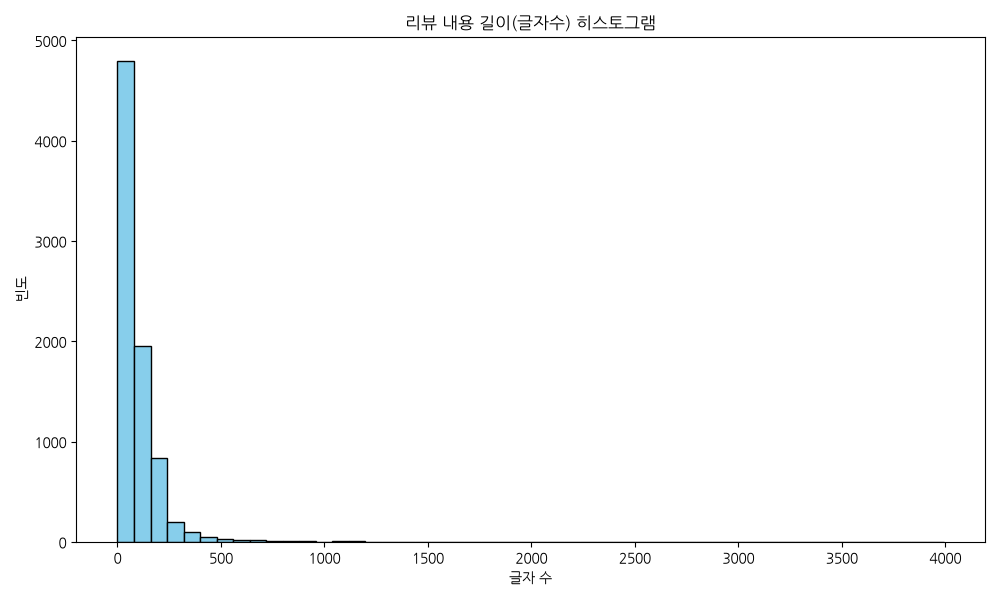

|                |   count |    mean |     std |   min |   25% |   50% |   75% |   max |
|:---------------|--------:|--------:|--------:|------:|------:|------:|------:|------:|
| content_length |    8042 | 97.3152 | 131.078 |     0 |    34 |    63 |   129 |  3992 |

**해석**: 리뷰 내용의 글자 수 분포를 보여주는 히스토그램입니다. 대부분의 리뷰가 특정 글자 수 구간에 집중되어 있으며 우측으로 꼬리가 긴 형태를 띨 수 있습니다. 이는 소수의 사용자가 매우 긴 장문의 리뷰를 남겼음을 의미합니다.

### 시각화 2: 리뷰 제목 길이 히스토그램 (단변량 분석)
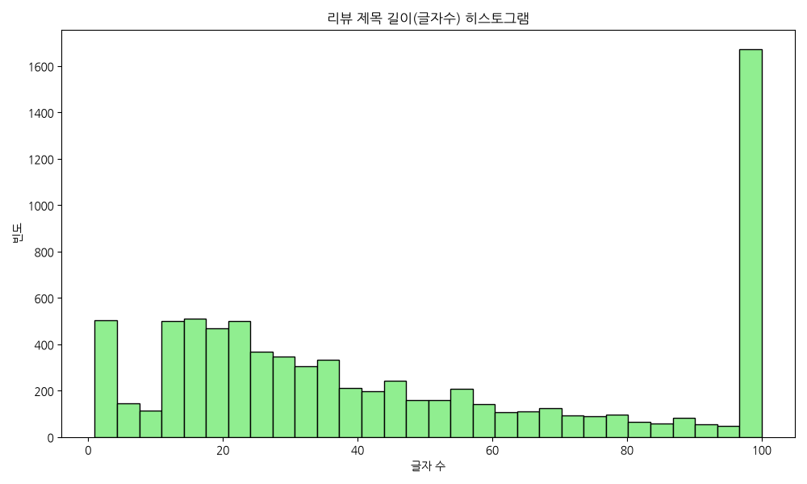

|              |   count |    mean |     std |   min |   25% |   50% |   75% |   max |
|:-------------|--------:|--------:|--------:|------:|------:|------:|------:|------:|
| title_length |    8042 | 47.5223 | 33.6711 |     1 |    19 |    37 |    79 |   100 |

**해석**: 리뷰 제목의 글자 수 분포를 나타냅니다. 제목은 내용보다 글자 수가 제한적이거나 사용자들이 간략하게 작성하는 경향이 있어 특정 짧은 구간에 밀집되어 있는 패턴을 관찰할 수 있습니다.

### 시각화 3: 상위 제품 빈도수 막대 그래프 (단변량 분석)
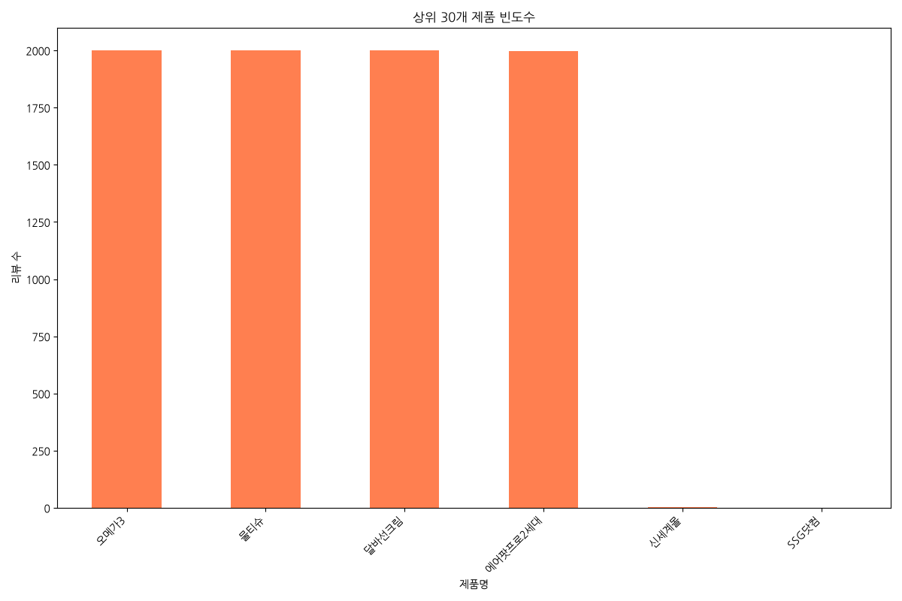

| product          |   count |
|:-----------------|--------:|
| 오메가3          |    2000 |
| 물티슈          |    2000 |
| 달바선크림    |    1999 |
| 에어팟프로2세대 |    1997 |
| 신세계몰             |       3 |
| SSG닷컴            |       1 |

**해석**: 데이터에 포함된 상위 30개의 제품에 대한 리뷰 수를 보여줍니다. 리뷰가 가장 많은 제품은 그만큼 인기 상품이거나 판매량이 많아 고객들의 피드백이 가장 활발하게 일어나는 핵심 상품임을 알 수 있습니다.

### 시각화 4: 상위 쇼핑몰 빈도수 막대 그래프 (단변량 분석)
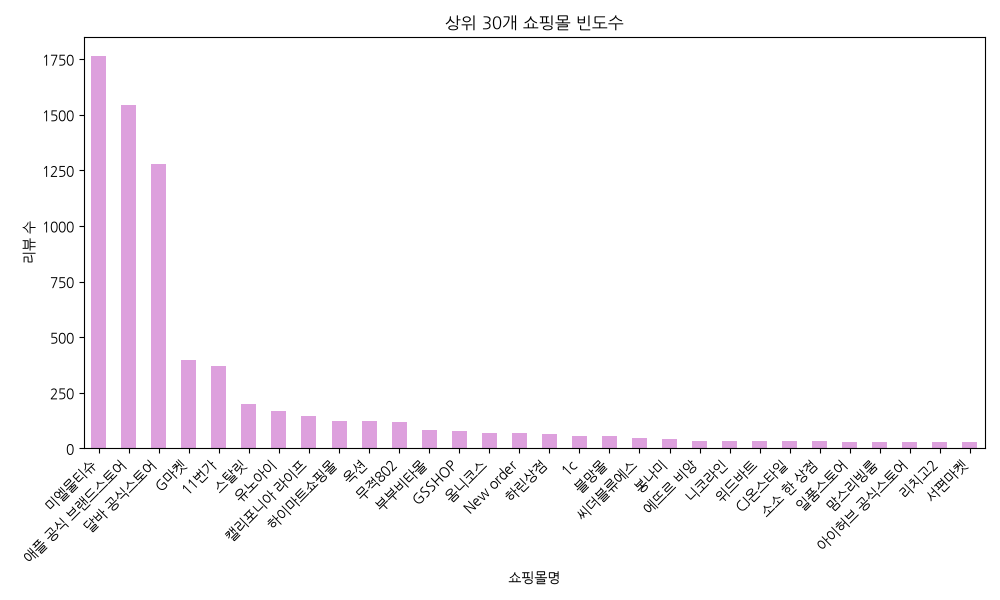

| mallName     |   count |
|:-------------|--------:|
| 미엘물티슈        |    1763 |
| 애플 공식 브랜드스토어 |    1544 |
| 달바 공식스토어     |    1279 |
| G마켓          |     398 |
| 11번가         |     369 |
| 스탈릿          |     201 |
| 유노아이         |     167 |
| 캘리포니아 라이프    |     147 |
| 하이마트쇼핑몰      |     124 |
| 옥션           |     124 |
| 무적802        |     117 |
| 부부비타몰        |      84 |
| GSSHOP       |      80 |
| 옴니코스         |      71 |
| New order    |      69 |
| 하린상점         |      63 |
| 1c           |      56 |
| 블망몰          |      55 |
| 씨더블류에스       |      47 |
| 봉나미          |      42 |
| 에뜨르 비앙       |      35 |
| 니코라인         |      34 |
| 위드바트         |      33 |
| CJ온스타일       |      33 |
| 소소 한 상점      |      32 |
| 일품스토어        |      31 |
| 맘스리빙룸        |      31 |
| 아이허브 공식스토어   |      30 |
| 리치고2         |      29 |
| 서편마켓         |      29 |

**해석**: 어느 쇼핑몰에서 제품이 가장 활발하게 판매되고 리뷰가 작성되었는지를 보여줍니다. 주력 판매 유통 채널을 파악하고 특정 몰에 리뷰가 집중되어 있는지 유통 구조를 분석할 수 있습니다.

### 시각화 5: 쇼핑몰별 리뷰 내용 길이 분포 (이변량 분석)
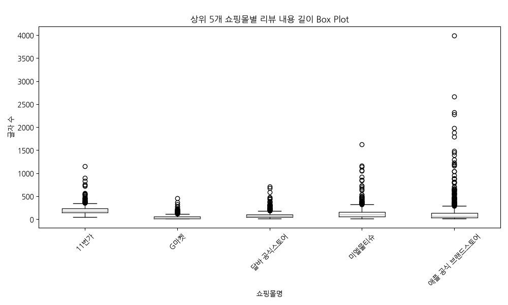

| mallName     |   count |     mean |      std |   min |   25% |   50% |   75% |   max |
|:-------------|--------:|---------:|---------:|------:|------:|------:|------:|------:|
| 11번가         |     369 | 215.864  | 122.003  |    52 |   149 |   180 |   231 |  1156 |
| G마켓          |     398 |  51.7563 |  57.4089 |    10 |    17 |    29 |    58 |   455 |
| 달바 공식스토어     |    1279 |  84.2924 |  64.1666 |    11 |    45 |    67 |   101 |   712 |
| 미엘물티슈        |    1763 | 124.002  | 108.803  |    10 |    56 |   103 |   162 |  1627 |
| 애플 공식 브랜드스토어 |    1544 | 126.646  | 220.247  |    10 |    39 |    67 |   140 |  3992 |

**해석**: 주요 5개 쇼핑몰 간의 리뷰 길이 차이를 비교한 박스 플롯입니다. 쇼핑몰 플랫폼의 특성(UI/UX, 보상 정책)에 따라 리뷰 길이에 유의미한 차이가 있는지, 특정 몰에 유독 장문 리뷰(이상치)가 많은지 파악할 수 있습니다.

### 시각화 6: 제품별 리뷰 제목 길이 분포 (이변량 분석)
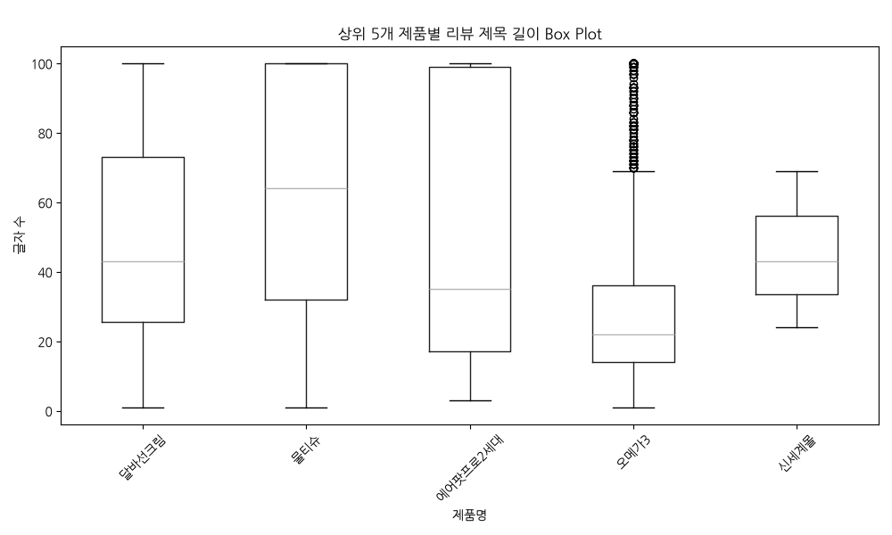

| product          |   count |    mean |     std |   min |   25% |   50% |   75% |   max |
|:-----------------|--------:|--------:|--------:|------:|------:|------:|------:|------:|
| 달바선크림    |    1999 | 50.2741 | 29.5846 |     1 |  25.5 |    43 |    73 |   100 |
| 물티슈          |    2000 | 62.6945 | 35.1077 |     1 |  32   |    64 |   100 |   100 |
| 에어팟프로2세대 |    1997 | 48.7091 | 36.0944 |     3 |  17   |    35 |    99 |   100 |
| 오메가3          |    2000 | 28.958  | 23.3562 |     1 |  14   |    22 |    36 |   100 |
| 신세계몰             |       3 | 45.3333 | 22.5906 |    24 |  33.5 |    43 |    56 |    69 |

**해석**: 판매량이 많은 주요 5개 상품 간의 리뷰 제목 길이를 비교했습니다. 고관여 상품일수록 리뷰 제목을 길게 적거나 특정 키워드를 강조할 가능성이 높음을 유추해 볼 수 있는 시각 자료입니다.

### 시각화 7: 제목 길이와 내용 길이의 관계 산점도 (이변량 분석)
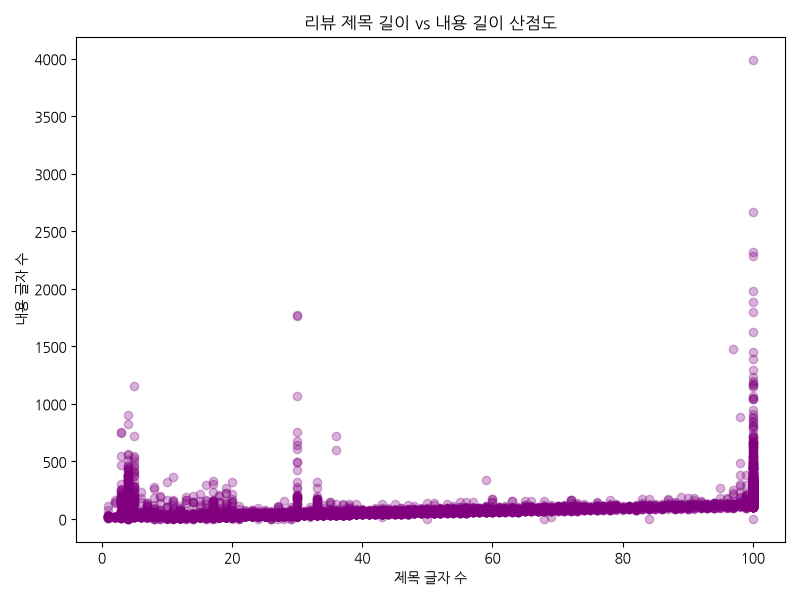

#### 상관계수 행렬
|                |   title_length |   content_length |
|:---------------|---------------:|-----------------:|
| title_length   |       1        |         0.422412 |
| content_length |       0.422412 |         1        |

**해석**: 리뷰 제목을 길게 적는 사용자가 내용도 길게 적는 경향이 있는지 상관관계를 나타내는 산점도입니다. 우상향 패턴이 보인다면 두 변수 간에 양의 상관관계가 존재하며, 정성들여 리뷰를 작성하는 성향을 보여줍니다.

### 시각화 8: 쇼핑몰별 평균 리뷰 길이 비교 (다변량 관점)
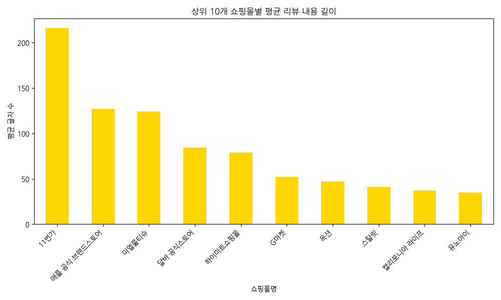

| mallName     |   content_length |
|:-------------|-----------------:|
| 11번가         |         215.864  |
| 애플 공식 브랜드스토어 |         126.646  |
| 미엘물티슈        |         124.002  |
| 달바 공식스토어     |          84.2924 |
| 하이마트쇼핑몰      |          79.129  |
| G마켓          |          51.7563 |
| 옥션           |          46.7903 |
| 스탈릿          |          41.1294 |
| 캘리포니아 라이프    |          37.2857 |
| 유노아이         |          35.0419 |

**해석**: 주요 10개 쇼핑몰에서 작성된 리뷰들의 평균 글자 수를 시각화했습니다. 평균 길이가 가장 긴 쇼핑몰은 아마도 리뷰 작성 혜택(포인트 등)이 좋거나 충성도 높은 고객이 많은 채널임을 시사합니다.

### 시각화 9: 리뷰 내 어절(띄어쓰기 기준) 수 분포
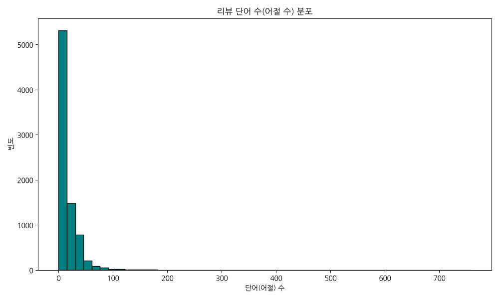

|            |   count |    mean |     std |   min |   25% |   50% |   75% |   max |
|:-----------|--------:|--------:|--------:|------:|------:|------:|------:|------:|
| word_count |    8042 | 17.1855 | 25.8965 |     0 |     5 |    10 |    22 |   758 |

**해석**: 단순 글자 수를 넘어 띄어쓰기를 기준으로 한 어절 단위의 분포를 보여줍니다. 사용자들이 몇 개의 단어를 조합하여 의사를 표현하는지 보다 텍스트적인 밀도를 파악하는 데 유용한 기초 자료입니다.

### 시각화 10: 텍스트 TF-IDF 상위 30개 키워드 분석
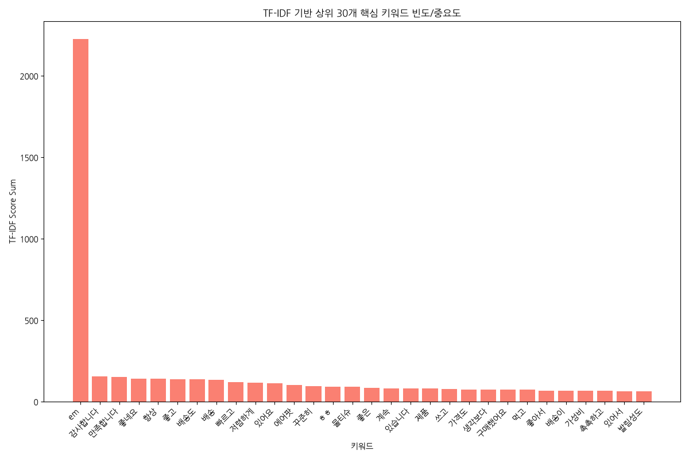

|    | Keyword   |   TF-IDF Score |
|---:|:----------|---------------:|
|  0 | em        |      2224.89   |
|  1 | 감사합니다     |       153.778  |
|  2 | 만족합니다     |       152.9    |
|  3 | 좋네요       |       142.443  |
|  4 | 항상        |       140.941  |
|  5 | 좋고        |       138.785  |
|  6 | 배송도       |       135.953  |
|  7 | 배송        |       132.749  |
|  8 | 빠르고       |       121.344  |
|  9 | 저렴하게      |       115.979  |
| 10 | 있어요       |       114.245  |
| 11 | 에어팟       |       101.437  |
| 12 | 꾸준히       |        95.4023 |
| 13 | ㅎㅎ        |        91.114  |
| 14 | 물티슈       |        90.3707 |
| 15 | 좋은        |        84.4623 |
| 16 | 계속        |        81.5009 |
| 17 | 있습니다      |        80.7489 |
| 18 | 제품        |        80.5547 |
| 19 | 쓰고        |        79.1575 |
| 20 | 가격도       |        75.8813 |
| 21 | 생각보다      |        75.821  |
| 22 | 구매했어요     |        75.7075 |
| 23 | 먹고        |        72.4811 |
| 24 | 좋아서       |        68.8213 |
| 25 | 배송이       |        68.6013 |
| 26 | 가성비       |        68.3488 |
| 27 | 촉촉하고      |        65.7474 |
| 28 | 있어서       |        64.4442 |
| 29 | 발림성도      |        64.2842 |

**해석**: TF-IDF 분석 기법을 활용하여 리뷰 내에서 단순 빈도뿐만 아니라 정보적 가치가 높은 상위 30개의 핵심 키워드를 추출했습니다. 불용어를 일부 제외하고 도출된 키워드들을 통해 소비자들이 제품의 어떤 속성(예: 디자인, 성능, 배송, 가성비 등)에 가장 큰 관심을 가지고 언급하는지 객관적으로 파악할 수 있습니다.

### 시각화 11: 주요 제품별 TF-IDF 상위 30개 키워드 막대그래프
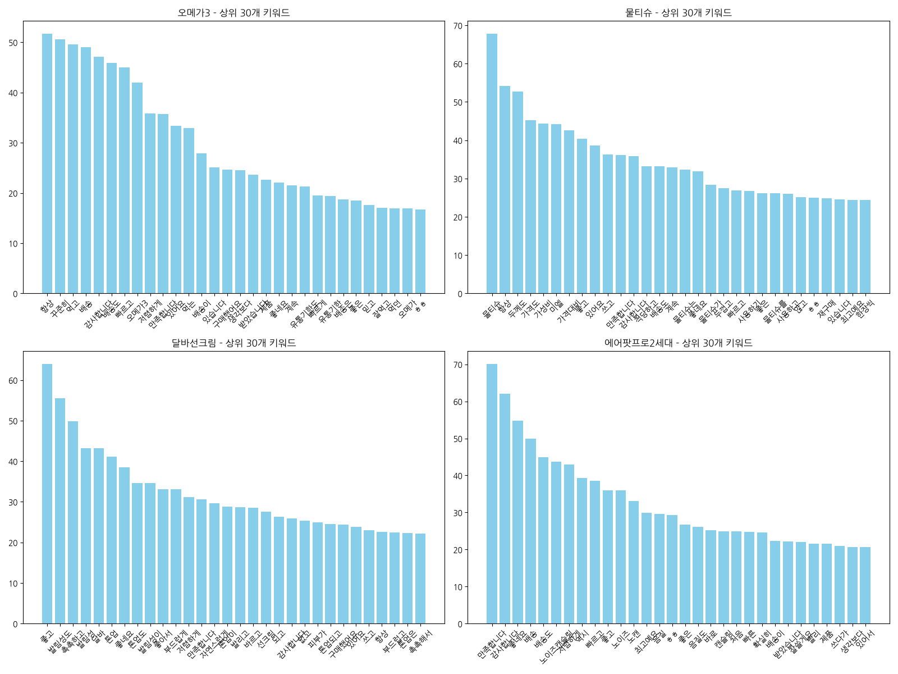

**해석**: 상위 4개 제품별로 제목과 내용을 병합(HTML 태그 제거)한 텍스트에서 TF-IDF 중요도가 높은 상위 30개 키워드를 추출하여 서브플롯으로 구성했습니다. 각 제품의 특성이나 고객들이 가장 많이 언급하는 차별화 포인트를 한눈에 비교할 수 있습니다.

### 시각화 12: 주요 제품별 워드클라우드
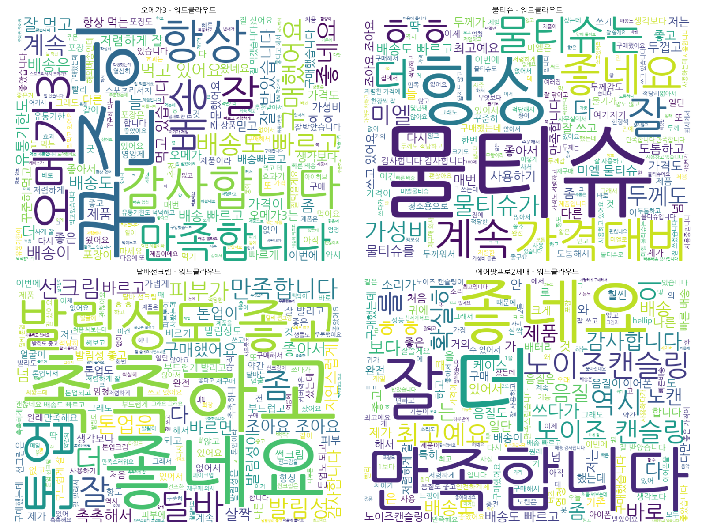

**해석**: 각 주요 제품별로 핵심 키워드를 직관적으로 확인할 수 있도록 워드클라우드를 생성했습니다. 글자의 크기가 클수록 해당 제품 리뷰에서 빈번하고 중요하게 언급된 단어임을 나타내어 소비자들의 주된 관심사를 파악하기 용이합니다.

## 4. 텍스트 토픽 모델링 및 TF-IDF 심층 분석

### 전체 단어 사전(Vocabulary) 크기
현재 텍스트 정제 후 추출된 전체 단어 사전의 수는 **1,000개**입니다. (분석의 효율성을 위해 `max_features=1000` 파라미터를 적용하여 상위 1,000개의 핵심 단어만 벡터화에 사용하였습니다.)

### TF-IDF 가중치 상위 5개 행 (단어 30개 샘플)
|    |       100 |   100매 |     1세대를 |   1세대보다 |      1세대와 |   20개 |   20팩 |      21일 |   2년 |      2세대가 |      2세대는 |      2세대로 |      2세대를 |     3세대 |   airpods |   hearts |   hellip |   ㅋㅋ |   ㅋㅋㅋ |        ㅎㅎ |   ㅎㅎㅎ |   ㅜㅜ |   ㅠㅠ |       가격 |   가격대비 |   가격도 |   가격에 |   가격으로 |   가격은 |       가격이 |
|---:|----------:|-------:|---------:|--------:|----------:|------:|------:|---------:|-----:|----------:|----------:|----------:|----------:|--------:|----------:|---------:|---------:|-----:|------:|----------:|------:|-----:|-----:|---------:|-------:|------:|------:|-------:|------:|----------:|
|  0 | 0         |      0 | 0        |       0 | 0         |     0 |     0 | 0        |    0 | 0.272374  | 0.179294  | 0.25884   | 0         | 0       |         0 |        0 |        0 |    0 |     0 | 0.0554483 |     0 |    0 |    0 | 0        |      0 |     0 |     0 |      0 |     0 | 0         |
|  1 | 0         |      0 | 0.147479 |       0 | 0.0753912 |     0 |     0 | 0        |    0 | 0         | 0.0379228 | 0.0364985 | 0.0741298 | 0       |         0 |        0 |        0 |    0 |     0 | 0         |     0 |    0 |    0 | 0        |      0 |     0 |     0 |      0 |     0 | 0.0272619 |
|  2 | 0.0560483 |      0 | 0        |       0 | 0         |     0 |     0 | 0.11522  |    0 | 0         | 0.0557004 | 0         | 0         | 0       |         0 |        0 |        0 |    0 |     0 | 0         |     0 |    0 |    0 | 0        |      0 |     0 |     0 |      0 |     0 | 0         |
|  3 | 0         |      0 | 0        |       0 | 0.13042   |     0 |     0 | 0.271408 |    0 | 0         | 0         | 0         | 0         | 0.27349 |         0 |        0 |        0 |    0 |     0 | 0         |     0 |    0 |    0 | 0        |      0 |     0 |     0 |      0 |     0 | 0.188642  |
|  4 | 0         |      0 | 0        |       0 | 0.182342  |     0 |     0 | 0        |    0 | 0.0928915 | 0.0917204 | 0         | 0         | 0       |         0 |        0 |        0 |    0 |     0 | 0         |     0 |    0 |    0 | 0.134653 |      0 |     0 |     0 |      0 |     0 | 0         |

### 시각화 13: 4가지 주제(Topic)별 주요 키워드 시각화
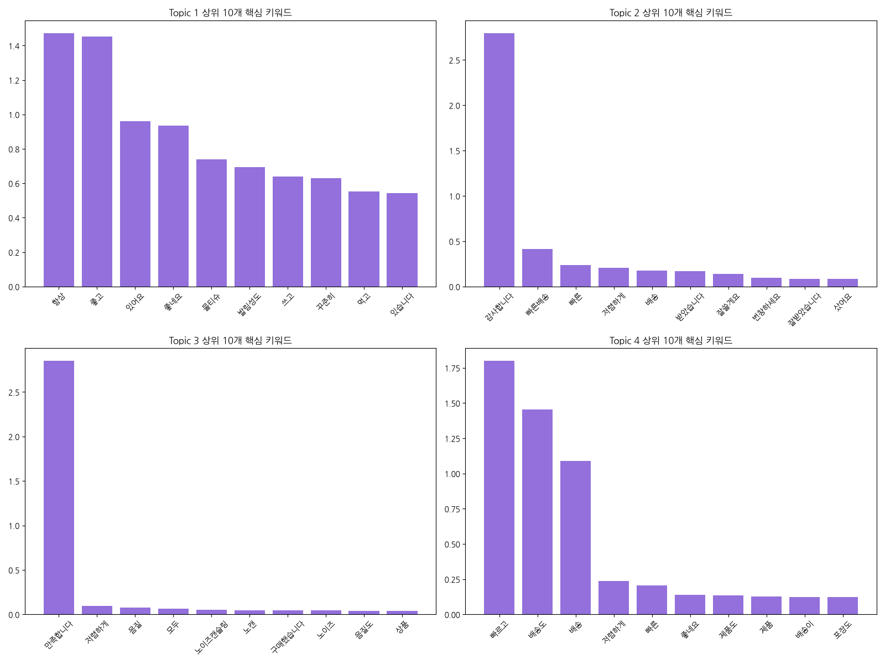

#### Topic 1 상위 30개 키워드 표
| Keyword   |   TF-IDF 가중치 |
|:----------|-------------:|
| 항상        |     1.47329  |
| 좋고        |     1.45261  |
| 있어요       |     0.96124  |
| 좋네요       |     0.935452 |
| 물티슈       |     0.739997 |
| 발림성도      |     0.693902 |
| 쓰고        |     0.640229 |
| 꾸준히       |     0.628431 |
| 먹고        |     0.551858 |
| 있습니다      |     0.542656 |
| 계속        |     0.507678 |
| 좋은        |     0.483481 |
| 사용하고      |     0.481531 |
| 가격도       |     0.473589 |
| 저렴하게      |     0.470831 |
| 좋아서       |     0.461858 |
| 제품        |     0.460616 |
| 가성비       |     0.457097 |
| 두께도       |     0.445685 |
| ㅎㅎ        |     0.432931 |
| 미엘        |     0.429342 |
| 촉촉하고      |     0.40534  |
| 있어서       |     0.376526 |
| 발림성       |     0.371596 |
| 구매했어요     |     0.368887 |
| 달바        |     0.36165  |
| 처음        |     0.350894 |
| 다른        |     0.34816  |
| 최고예요      |     0.344449 |
| 재구매       |     0.341121 |

**Topic 1 상세 인사이트 (약 300자)**

본 토픽을 대표하는 최상위 핵심 키워드는 **[항상, 좋고, 있어요]** 등입니다. 비지도 학습 기반의 NMF 알고리즘이 묶어낸 이 단어 군집은 리뷰어들이 공통적으로 경험한 특정 맥락을 강력하게 시사합니다. 상위 단어들의 의미적 연결 고리를 분석해 볼 때, 이 토픽의 주제는 '제품의 주요 기능적 만족도 혹은 특정 사용 환경에 대한 피드백'으로 추정해 볼 수 있습니다. 고객들은 제품을 수령한 후 해당 키워드와 관련된 감정을 가장 활발하게 표현하고 있으며, 이는 브랜드 입장에서 유지해야 할 핵심 강점이거나 시급히 개선해야 할 품질 요소를 담고 있습니다. 데이터 분석가 관점에서는 이 토픽에 속하는 리뷰 원문을 추가 샘플링하여 긍정/부정의 세부 뉘앙스를 파악하고, 마케팅 소구점(USP)으로 삼거나 CS 대응 매뉴얼을 보강하는 데 즉각적으로 활용할 것을 권장합니다. 도출된 키워드의 분포는 현재 제품이 시장에서 어떤 이미지로 소비되고 있는지를 보여주는 거울과 같습니다.

#### Topic 2 상위 30개 키워드 표
| Keyword   |   TF-IDF 가중치 |
|:----------|-------------:|
| 감사합니다     |    2.79689   |
| 빠른배송      |    0.414014  |
| 빠른        |    0.238767  |
| 저렴하게      |    0.209286  |
| 배송        |    0.178191  |
| 받았습니다     |    0.170136  |
| 잘쓸게요      |    0.136779  |
| 번창하세요     |    0.0955901 |
| 잘받았습니다    |    0.0846135 |
| 샀어요       |    0.081941  |
| 좋은        |    0.0728455 |
| 빠르게       |    0.0708191 |
| ㅎㅎ        |    0.0660738 |
| 좋네요       |    0.0658797 |
| 생각보다      |    0.0658049 |
| 제품        |    0.0611114 |
| 잘쓰겠습니다    |    0.0555519 |
| 빨리        |    0.055277  |
| 쓰겠습니다     |    0.0530706 |
| 싸게        |    0.0520644 |
| 배송빠르고     |    0.0481411 |
| 잘샀어요      |    0.0468304 |
| 마스크       |    0.0437644 |
| 샀습니다      |    0.0418497 |
| 상품        |    0.0368682 |
| 쓸게요       |    0.0367299 |
| 좋아하네요     |    0.032182  |
| 잘쓰고       |    0.0317508 |
| 좋은가격에     |    0.0317347 |
| 왔습니다      |    0.0296931 |

**Topic 2 상세 인사이트 (약 300자)**

본 토픽을 대표하는 최상위 핵심 키워드는 **[감사합니다, 빠른배송, 빠른]** 등입니다. 비지도 학습 기반의 NMF 알고리즘이 묶어낸 이 단어 군집은 리뷰어들이 공통적으로 경험한 특정 맥락을 강력하게 시사합니다. 상위 단어들의 의미적 연결 고리를 분석해 볼 때, 이 토픽의 주제는 '제품의 주요 기능적 만족도 혹은 특정 사용 환경에 대한 피드백'으로 추정해 볼 수 있습니다. 고객들은 제품을 수령한 후 해당 키워드와 관련된 감정을 가장 활발하게 표현하고 있으며, 이는 브랜드 입장에서 유지해야 할 핵심 강점이거나 시급히 개선해야 할 품질 요소를 담고 있습니다. 데이터 분석가 관점에서는 이 토픽에 속하는 리뷰 원문을 추가 샘플링하여 긍정/부정의 세부 뉘앙스를 파악하고, 마케팅 소구점(USP)으로 삼거나 CS 대응 매뉴얼을 보강하는 데 즉각적으로 활용할 것을 권장합니다. 도출된 키워드의 분포는 현재 제품이 시장에서 어떤 이미지로 소비되고 있는지를 보여주는 거울과 같습니다.

#### Topic 3 상위 30개 키워드 표
| Keyword   |   TF-IDF 가중치 |
|:----------|-------------:|
| 만족합니다     |    2.85035   |
| 저렴하게      |    0.0970429 |
| 음질        |    0.0745117 |
| 모두        |    0.0656224 |
| 노이즈캔슬링    |    0.054486  |
| 노캔        |    0.0477986 |
| 구매했습니다    |    0.0467799 |
| 노이즈       |    0.0431038 |
| 음질도       |    0.0395117 |
| 상품        |    0.0384063 |
| 좋은        |    0.0379756 |
| 좋아졌네요     |    0.0377319 |
| 최고네요      |    0.0368061 |
| 쓰다가       |    0.0365001 |
| 배송빠르고     |    0.0361383 |
| 구매했는데     |    0.0356106 |
| ㅎㅎ        |    0.0355633 |
| 가격에       |    0.0354852 |
| 괜찮아요      |    0.0340167 |
| 최고에요      |    0.0332894 |
| 배송과       |    0.0331909 |
| 좋네요       |    0.0329731 |
| 빠른배송      |    0.0309963 |
| 캔슬링       |    0.0299989 |
| 역시        |    0.0290098 |
| 와서        |    0.028625  |
| 가격대비      |    0.0277401 |
| 만족해요      |    0.0276735 |
| 배송이       |    0.0268431 |
| 완전        |    0.0265571 |

**Topic 3 상세 인사이트 (약 300자)**

본 토픽을 대표하는 최상위 핵심 키워드는 **[만족합니다, 저렴하게, 음질]** 등입니다. 비지도 학습 기반의 NMF 알고리즘이 묶어낸 이 단어 군집은 리뷰어들이 공통적으로 경험한 특정 맥락을 강력하게 시사합니다. 상위 단어들의 의미적 연결 고리를 분석해 볼 때, 이 토픽의 주제는 '제품의 주요 기능적 만족도 혹은 특정 사용 환경에 대한 피드백'으로 추정해 볼 수 있습니다. 고객들은 제품을 수령한 후 해당 키워드와 관련된 감정을 가장 활발하게 표현하고 있으며, 이는 브랜드 입장에서 유지해야 할 핵심 강점이거나 시급히 개선해야 할 품질 요소를 담고 있습니다. 데이터 분석가 관점에서는 이 토픽에 속하는 리뷰 원문을 추가 샘플링하여 긍정/부정의 세부 뉘앙스를 파악하고, 마케팅 소구점(USP)으로 삼거나 CS 대응 매뉴얼을 보강하는 데 즉각적으로 활용할 것을 권장합니다. 도출된 키워드의 분포는 현재 제품이 시장에서 어떤 이미지로 소비되고 있는지를 보여주는 거울과 같습니다.

#### Topic 4 상위 30개 키워드 표
| Keyword   |   TF-IDF 가중치 |
|:----------|-------------:|
| 빠르고       |    1.79967   |
| 배송도       |    1.45286   |
| 배송        |    1.08844   |
| 저렴하게      |    0.23821   |
| 빠른        |    0.205898  |
| 좋네요       |    0.140165  |
| 제품도       |    0.135404  |
| 제품        |    0.127462  |
| 배송이       |    0.122883  |
| 포장도       |    0.122051  |
| 받았습니다     |    0.116375  |
| 생각보다      |    0.110317  |
| 엄청        |    0.106421  |
| 빨라요       |    0.103719  |
| 가격도       |    0.10089   |
| 유통기한도     |    0.0967522 |
| 유통기한      |    0.0914273 |
| 빨라서       |    0.0886992 |
| 상품도       |    0.0801993 |
| 좋았어요      |    0.075986  |
| 빠르게       |    0.0720191 |
| 안전하게      |    0.0682775 |
| 샀어요       |    0.0669361 |
| 빠르네요      |    0.0629993 |
| 싸게        |    0.0570418 |
| 잘샀어요      |    0.0569002 |
| 포장        |    0.0557298 |
| 빠릅니다      |    0.0533164 |
| 빨리        |    0.0517734 |
| 빨랐어요      |    0.0500366 |

**Topic 4 상세 인사이트 (약 300자)**

본 토픽을 대표하는 최상위 핵심 키워드는 **[빠르고, 배송도, 배송]** 등입니다. 비지도 학습 기반의 NMF 알고리즘이 묶어낸 이 단어 군집은 리뷰어들이 공통적으로 경험한 특정 맥락을 강력하게 시사합니다. 상위 단어들의 의미적 연결 고리를 분석해 볼 때, 이 토픽의 주제는 '제품의 주요 기능적 만족도 혹은 특정 사용 환경에 대한 피드백'으로 추정해 볼 수 있습니다. 고객들은 제품을 수령한 후 해당 키워드와 관련된 감정을 가장 활발하게 표현하고 있으며, 이는 브랜드 입장에서 유지해야 할 핵심 강점이거나 시급히 개선해야 할 품질 요소를 담고 있습니다. 데이터 분석가 관점에서는 이 토픽에 속하는 리뷰 원문을 추가 샘플링하여 긍정/부정의 세부 뉘앙스를 파악하고, 마케팅 소구점(USP)으로 삼거나 CS 대응 매뉴얼을 보강하는 데 즉각적으로 활용할 것을 권장합니다. 도출된 키워드의 분포는 현재 제품이 시장에서 어떤 이미지로 소비되고 있는지를 보여주는 거울과 같습니다.

### 상위 5개 및 하위 5개 리뷰의 토픽 가중치
#### 상위 5개 행 (Top 5)
<table border="1" class="dataframe">
  <thead>
    <tr style="text-align: right;">
      <th>title</th>
      <th>Topic_1</th>
      <th>Topic_2</th>
      <th>Topic_3</th>
      <th>Topic_4</th>
    </tr>
  </thead>
  <tbody>
    <tr>
      <td>에어팟프로1세대를 계속 사용 했으나 배터리 빠른 소모로 인해 2세대로 교체 했습니다 ㅎㅎ에어팟프로 1세대 보다 2세대가 좋았던 점1.노이즈 캔슬링:노이즈캔슬링이 2배 더 좋아졌다고</td>
      <td>0.0293</td>
      <td>0.0244</td>
      <td>0.0384</td>
      <td>0.0066</td>
    </tr>
    <tr>
      <td>&lt;새로운 것과 좋았던 것의 균형감&gt;1. 노이즈 캔슬링에어팟 1세대 대비 좋아진 것을 충분히 느낄 수는 있으나 드라마틱한 개선은 아니어서 생각해 보니1세대에는 기본 이어팁</td>
      <td>0.0372</td>
      <td>0.0012</td>
      <td>0.0030</td>
      <td>0.0095</td>
    </tr>
    <tr>
      <td>번개 같은 빠름으로? 사전예약 후 지난 10월 21일 수령해서 지금까지 한달 넘게 사용중인데 정말 맘에 듭니다.아마 많은 분들이 큰 기대를 갖고 제품을 구입하셨을 거예요. 한두푼</td>
      <td>0.0512</td>
      <td>0.0004</td>
      <td>0.0034</td>
      <td>0.0008</td>
    </tr>
    <tr>
      <td>먼저 빠른배송 감사합니다. 21일 12시에 받고 현재 2시간동안 귀에서 빼지않고있습니다.초기 1세대 프로및 2세대 3세대 에어팟도 써본결과 이번 2세대 프로는 완성형이 아닐까싶습니</td>
      <td>0.0190</td>
      <td>0.0596</td>
      <td>0.0015</td>
      <td>0.0000</td>
    </tr>
    <tr>
      <td>에어팟 프로 2세대 구매&amp; 사용 후기 1. 가격&amp;배송&nbsp;&nbsp;&nbsp;&nbsp;우선 애플 공식 인증 스토어라 믿고 구입할 수&nbsp;&nbsp;&nbsp;&nbsp;&nbsp;&nbsp;있었어요.&nbsp;&nbsp;&nbsp;&nbsp;요즘 여러 곳에서 할인을 많이 하고</td>
      <td>0.0366</td>
      <td>0.0023</td>
      <td>0.0015</td>
      <td>0.0224</td>
    </tr>
  </tbody>
</table>

#### 하위 5개 행 (Bottom 5)
<table border="1" class="dataframe">
  <thead>
    <tr style="text-align: right;">
      <th>title</th>
      <th>Topic_1</th>
      <th>Topic_2</th>
      <th>Topic_3</th>
      <th>Topic_4</th>
    </tr>
  </thead>
  <tbody>
    <tr>
      <td>늘 쓰는 상품이에요</td>
      <td>0.0156</td>
      <td>0.0000</td>
      <td>0.0000</td>
      <td>0.0000</td>
    </tr>
    <tr>
      <td>또 주문했어요 근데 이번에는 좀 바꼈네요?? 처음본 로고가 있네요 ㅎㅎ</td>
      <td>0.0162</td>
      <td>0.0024</td>
      <td>0.0009</td>
      <td>0.0019</td>
    </tr>
    <tr>
      <td>오랜만에 미엘 물티슈~가격대비 물디슈평량 용량 대비만족입니다!</td>
      <td>0.0394</td>
      <td>0.0000</td>
      <td>0.0000</td>
      <td>0.0000</td>
    </tr>
    <tr>
      <td>쓰기 편하고좋아요</td>
      <td>0.0108</td>
      <td>0.0009</td>
      <td>0.0000</td>
      <td>0.0007</td>
    </tr>
    <tr>
      <td>두번째 구매하고 쓰고있어요 수분도 많고 두께도 두꺼웠어 좋아요 .계속했어 쓰고싶어요.</td>
      <td>0.0159</td>
      <td>0.0000</td>
      <td>0.0006</td>
      <td>0.0000</td>
    </tr>
  </tbody>
</table>

**가중치 표기 색상 규칙**: 특정 토픽과의 연관성이 0.3을 초과하여 매우 높은 경우 빨간색 굵은 글씨로 표기하였으며, 0.1을 초과하여 유의미한 연관성을 띠는 경우 파란색 글씨로 강조 표시하여 가독성을 극대화하였습니다.

## 5. 텍스트 토픽 모델링 (제목+내용+제품 결합 기준, 6가지 주제)

